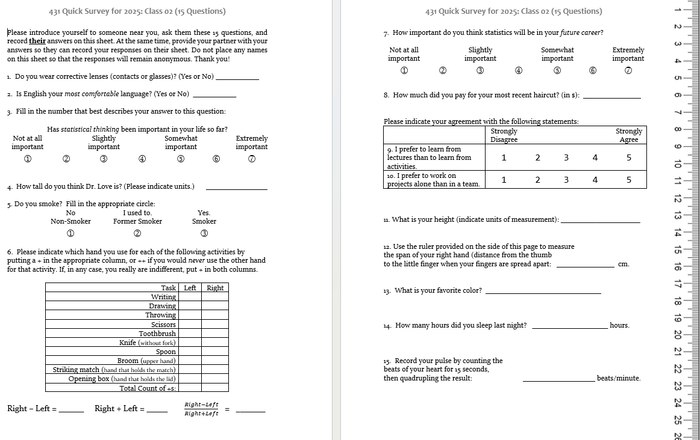
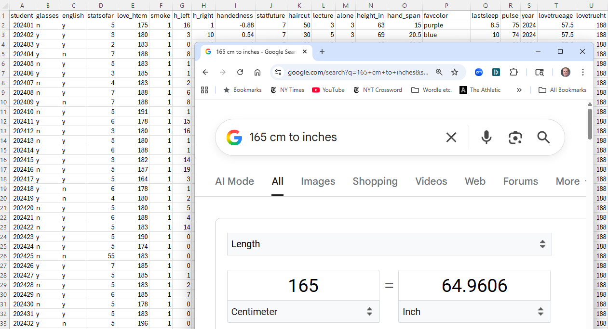
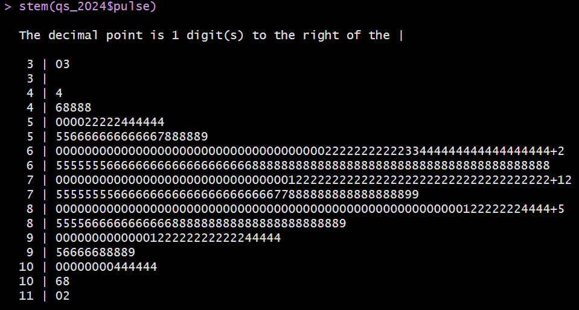
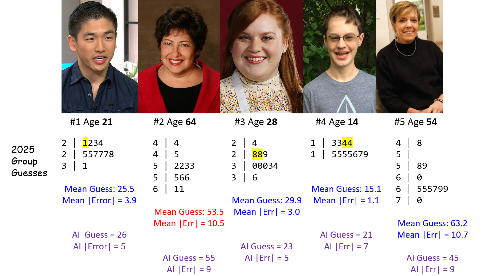
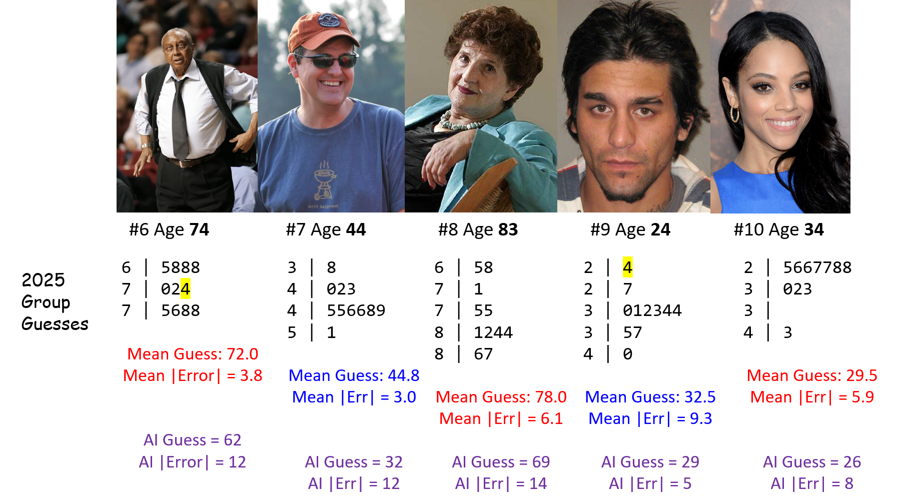

## Instructions for the Quick Survey

Please read these instructions **before** writing.

1.  Introduce yourself to someone that you don't know.
2.  Record the survey answers **for that other person**, while they record your responses.
3.  Be sure to complete all 15 questions (both sides.)
4.  When you are finished, thank your partner and raise your hand. Someone will come to collect your survey.

Regarding Question 4, Professor Love is the large fellow standing in the front of the room.

## Today's Agenda

-   Data Structures and Variables
    -   Evaluating some of the Quick Survey variables
-   Looking at some of the data collected in Class 01
    -   Group Guessing of Ages from 10 Photographs
    -   Guessing Dr. Love's Age (twice)
- Welcome to 431 Survey Report
- What to work on this weekend

## The R Packages I'll Load Today

```{r}
#| echo: true
#| message: false

library(janitor)
library(rstanarm)
library(easystats)
library(tidyverse)

source("c02/data/Love-431.R")

knitr::opts_chunk$set(comment = NA)
```

-   If you actually run this in R, you will get some messages which we will suppress and ignore today.


## Chatfield's Six Rules for Data Analysis

1.  Do not attempt to analyze the data until you understand what is being measured and why.
2.  Find out how the data were collected.
3.  Look at the structure of the data.
4.  Carefully examine the data in an exploratory way, before attempting a more sophisticated analysis.
5.  Use your common sense at all times.
6.  Report the results in a clear, self-explanatory way.

::: aside
Chatfield, Chris (1996) *Problem Solving: A Statistician's Guide*, 2nd ed.
:::

## Our Quick Survey



## Types of Data

The key distinction we'll make is between

-   **quantitative** (numerical) and
-   **categorical** (qualitative) information.

Information that is quantitative describes a **quantity**.

-   All quantitative variables have units of measurement.
-   Quantitative variables are recorded in numbers, and we use them as numbers (for instance, taking a mean of the variable makes some sense.)

## Continuous vs. Discrete Quantities

**Continuous** variables (can take any value in a range) vs. **Discrete** variables (limited set of potential values)

-   Is Height a continuous or a discrete variable?

::: incremental
-   Height is certainly continuous as a concept, but how precise is our ruler?
-   Piano vs. Violin
:::

## Quantitative Variable Subtypes

We can also distinguish **interval** (equal distance between values, but zero point is arbitrary) from **ratio** variables (meaningful zero point.)

::: incremental
-   Is Weight an interval or ratio variable?
-   How about IQ?
:::

## Qualitative (Categorical) Data

Qualitative variables consist of names of categories.

-   Each possible value is a code for a category (could use numerical or non-numerical codes.)
    -   **Binary** categorical variables (two categories, often labeled 1 or 0)
    -   **Multi-categorical** variables (three or more categories)
-   Can distinguish *nominal* (no underlying order) vs. *ordinal* (categories are ordered.)

## Some Categorical Variables

-   How is your overall health? <br /> (Excellent, Very Good, Good, Fair, Poor)
-   Which candidate would you vote for if the election were held today?
-   Did this patient receive this procedure?
-   If you needed to analyze a small data set right away, which of the following software tools would you be comfortable using to accomplish that task?

## Are these quantitative or categorical?

1.  Do you **smoke**? (1 = Non-, 2 = Former, 3 = Smoker)
2.  How much did you pay for your most recent **haircut**? (in \$)
3.  What is your favorite **color**?
4.  How many hours did you **sleep** last night?
5.  Statistical thinking in your future **career**? (1 = Not at all important to 7 = Extremely important)

-   If quantitative, are they *discrete* or *continuous*? Do they have a meaningful *zero point*?
-   If categorical, how many categories? *Nominal* or *ordinal*?

## Importing and Tidying Data


## Ingesting the Quick Surveys



## The Quick Survey

Over 10 years, 547 people took (essentially) the same survey in the same way.

| Fall | 2024 | 2022 | 2021 | 2020 | 2019 | 
|-----:|-----:|-----:|-----:|-----:|-----:|
|  *n* |   53 |   54 |   58 |   67 |   61 | 


| Fall | 2018 | 2017 | 2016 | 2015 | 2014 |   Total |
|-----:|-----:|-----:|-----:|-----:|-----:|--------:|
|  *n* |   51 |   48 |   64 |   49 |   42 | **547** |

### Question

What percentage of those 547 surveys caused *no problems* in recording responses?

## The 15 Survey Items

|  \# | Topic          |  \# | Topic                    |
|----:|----------------|----:|--------------------------|
|  Q1 | `glasses`      |  Q9 | `lectures_vs_activities` |
|  Q2 | `english`      | Q10 | `projects_alone`         |
|  Q3 | `stats_so_far` | Q11 | `height`                 |
|  Q4 | `guess_TL_ht`  | Q12 | `hand_span`              |
|  Q5 | `smoke`        | Q13 | `color`                  |
|  Q6 | `handedness`   | Q14 | `sleep`                  |
|  Q7 | `stats_future` | Q15 | `pulse_rate`             |
|  Q8 | `haircut`      |  \- | \-                       |

-   At one time, I asked about `sex` rather than `glasses`.
-   In prior years, people guessed my age, rather than height here.
-   Sometimes, I've asked for a 30-second pulse check, then doubled.

## Response to the Question I asked

What percentage of those 547 surveys caused *no problems* in recording responses?

::: incremental

-   Guesses?
-   196/547 (36%) caused no problems.

:::

## Guess My Age


What should we do in these cases?

## English best language?


## Height


## Handedness Scale (2016-21 version)


## Favorite color


## Following the Rules? (2019 version)


### 2019 `pulse` responses, sorted (*n* = 61, 1 NA)

```         
 33  46  48  56  60  60            3 | 3
 62  63  65  65  66  66            4 | 68
 68  68  68  69  70  70            5 | 6
 70  70  70  70  70  70            6 | 002355668889        
 71  72  72  74  74  74            7 | 00000000122444445666888
 74  74  75  76  76  76            8 | 000012445668
 78  78  78  80  80  80            9 | 000046
 80  81  82  84  84  85           10 | 44
 86  86  88  90  90  90           11 | 0
 90  94  96 104 104 110 
```

## Stem and Leaf: Pulse Rates 2014-2024



(Thanks, John **Tukey**)

## Garbage in, garbage out ...


# Group Age Guessing from Photos <br /> (11 groups in 2025, 10 Photos)

## Photos 1-5



## Photos 6-10



## 2025 Groups 1-6: Guessing Ten Photos {.smaller}

Group | Within 2 | Within 5 | Too Low | Correct | Too High | Beat AI
:-----:|:-----:|:-----:|:-----:|:-----:|:-----:|:-----:|:-----:
Less than 0.05 | 4 | 5 | 4 | 2 | 4 | 6
Big Data | 2 | 4 | 4 | 1 | 5 | 7
Bio-Baddies | 3 | 4 | 4 | 1 | 5 | 6
Bonferroni | 4 | 4 | 6 | 1 | 3 | 7
Multicultural Thunder | 4 | 7 | 7 | 1 | 2 | 7
TukeySEASE | 4 | 6 | 6 | 1 | 3 | 6

*These groups each guessed at least one age correctly. The other groups (and AI results) follow on the next slide.*

## 2025 Groups 7-11 and AI: Ten Photos {.smaller}

Group | Within 2 | Within 5 | Too Low | Correct | Too High | Beat AI
:-----:|:-----:|:-----:|:-----:|:-----:|:-----:|:-----:|:-----:
CAAH | 2 | 5 | 8 | 0 | 2 | 5
Chipmunk | 3 | 6 | 7 | 0 | 3 | 7
Mangos | 4 | 6 | 3 | 0 | 7 | 7
Mean Squad | 3 | 6 | 5 | 0 | 5 | 8
Pillars of Freedom | 3 | 4 | 6 | 0 | 4 | 7
AI (2025) | 0 | 3 | 3 | 0 | 7 | --

- AI tool is <https://howolddoyoulook.com/> used on 2025-08-21.

::: incremental

-   So ... who wins?
-   What other summaries might be helpful in deciding who wins?

:::

## Consider the AI (2025) results {.smaller}

Subject | Photo | AI guess | True Age | Error
:-------: | -----: | :-----: | :------: | :-----:
Chong | 1 | 26 | 21 | 5
Archuleta | 2 | 55 | 64 | -9
Mayfield | 3 | 23 | 28 | 5
... | 
Lawson | 10 | 26 | 34 | -8

- Sum of AI errors = 5 + (-9) + (-5) + 7 + (-9) + (-12) + (-12) + (-14) + 5 + (-8) = -52

::: incremental
- Mean of AI errors across 10 photos is -5.2 years.
- Minimum AI error is -14 years, Maximum AI error is 7 years 
- Median of the AI errors = -8.5 years.
- Standard Deviation of the AI errors = 7.9 years.
:::

##  {.smaller}

2025 Groups | Mean Error | SD (Err) | Median (Err) | (Min, Max) Err |
|:----------:|:--------:|:--------:|:--------:|:--------:|
Less than 0.05 | -2.6 | 10.3 | 0 | -20, 16
Big Data | -2.2 | 7.5 | -3 | -12, 10
Bio-Baddies | 0.2 | 7.9 | -0.5 | -12, 15
Bonferroni | 1.8 | 8.2 | 1 | -8, 16
Multicultural Thunder | 2.6 | 5.9 | 2 | -7, 15
TukeySEASE | 1.6 | 6.7 | 1 | -12, 11
CAAH | 4.9 | 4.7 | 5 | -3, 11
Chipmunk | 2.4 | 6.3 | 2 | -8, 13
Mangos | -1.7 | 7.7 | -1.5 | -19, 8
Mean Squad | -2.6 | 7.4 | 0 | -18, 6
Pillars of Freedom | -0.1 | 7.6 | 1 | -11, 11
AI | -5.2 | 7.9 | -8.5 | -14, 7

## Summaries of Errors

- How helpful are the summaries on the previous slide in this setting?
- Should we be looking at |error| or maybe squared error?

AI errors are: 5, -9, -5, 7, -9, -12, -12, -14, 5, -8

::: incremental
- Sum of the AI errors is -52, and mean error is -5.2
- For AI, sum of the |errors| = 86, so mean absolute error is 8.6 years
- Sum of squared errors is 834, so mean squared error is 83.4, whose square root (RMSE) = 9.13
:::

## Absolute and Squared Errors {.smaller}

- **AE** = Absolute Value of Error = \|guess - actual\|
- **RMSE** = square Root of Mean Squared Error

Group         | Mean AE | Range (AE) | Median AE | RMSE 
:--------------------:|:--------:|:----------:|:----------:|:-----:
Less than 0.05 | 7.4 | (0, 20) | 5 | 10.11
Big Data | 6.4 | (0, 12) | 6 | 7.43
Bio-Baddies | 6.0 | (0, 15) | 6 | 7.50
Bonferroni | 6.2 | (0, 16) | 6.5 | 8.02
Multicultural Thunder | 4.6 | (0, 15) | 3.5 | 6.18
TukeySEASE | 5.0 | (0, 12) | 4 | 6.56

## Absolute and Squared Errors {.smaller}

- **AE** = Absolute Value of Error = \|guess - actual\|
- **RMSE** = square Root of Mean Squared Error

Group         | Mean AE | Range (AE) | Median AE | RMSE 
:--------------------:|:--------:|:----------:|:----------:|:-----:
CAAH | 5.7 | (1, 11) | 5 | 6.64
Chipmunk | 5.2 | (1, 13) | 4 | 6.45
Mangos | 5.5 | (1, 19) | 4.5 | 7.49
Mean Squad | 5.6 | (1, 18) | 3.5 | 7.50
Pillars of Freedom | 6.1 | (1, 11) | 6 | 7.22
AI | 8.6 | (5, 14) | 8.5 | 9.13

-  So ... now who wins? (next slide may help...)

## {.smaller}

Group         | Mean AE | Range (AE) | Median AE | RMSE | Within 2 | Within 5 
:--------------------:|:-----:|:----------:|:----------:|:-----: | :-----: | :-----:
Less than 0.05 | 7.4 | (0, 20) | 5 | 10.11 | [**4**]{.mark} | 5
Big Data | 6.4 | (0, 12) | 6 | 7.43 | 2 | 4
Bio-Baddies | 6.0 | (0, 15) | 6 | 7.50 | 3 | 4
Bonferroni | 6.2 | (0, 16) | 6.5 | 8.02 | [**4**]{.mark} | 4
Multicultural Thunder | [**4.6**]{.mark} | (0, 15) | [**3.5**]{.mark} | [**6.18**]{.mark} | [**4**]{.mark} | [**7**]{.mark}
TukeySEASE | 5.0 | (0, 12) | 4 | 6.56 | [**4**]{.mark} | 6
CAAH | 5.7 | (1, [**11**]{.mark}) | 5 | 6.64 | 2 | 5
Chipmunk | 5.2 | (1, 13) | 4 | 6.45 | 3 | 6
Mangos | 5.5 | (1, 19) | 4.5 | 7.49 | [**4**]{.mark} | 6
Mean Squad | 5.6 | (1, 18) | [**3.5**]{.mark} | 7.50 | 3 | 6
Pillars of Freedom | 6.1 | (1, [**11**]{.mark}) | 6 | 7.22 | 3 | 4
AI (2025-08-21) | 8.6 | (5, 14) | 8.5 | 9.13 | 0 | 3 

## Importing guesses from 2014-2025

```{r}
#| echo: true

photos <- 
  read_csv("c02/data/ten-photo-age-history-2025.csv",
           show_col_types = F)

photos <- photos |>
  mutate(label = fct_reorder(label, card))

head(photos)
```

## 2014-2025 Errors

```{r}
#| echo: false
ggplot(photos |> filter(year != "2025_AI" & year != "2025"), aes(x = label, y = error)) +
  geom_point(aes(col = year, fill = year), size = 3) +
  geom_point(data = photos |> filter(year == "2025"), aes(x = label, y = error), col = "black", shape = "X", size = 7) +
  geom_hline(yintercept = 0) +
  labs(title = "2014-2024 error sizes as compared to 2025", 
       subtitle = "Black X indicates 2025 class-wide result",
       x = "",
       y = "Guessing Error") +
  theme_light()
```

# Guessing My Age (Twice) <br /> from Class 01

## From our 431-Data Page: A `.csv` file

`love-age-guesses-2022-2025.csv` is on [our 431-data page](https://github.com/THOMASELOVE/431-data).


## Creating the `age_guess` Tibble

Clicking on RAW in the 431-data presentation takes us to a (long) URL that contains the raw data in this sheet.

I'll read in the sheet's data to a new **tibble** (a special kind of R data frame) called `age_guess` using the `read_csv()` function. 

```{r}
#| echo: true

url_age <- 
  "https://raw.githubusercontent.com/THOMASELOVE/431-data/main/data/love-age-guesses-2022-2025.csv"

age_guess <- read_csv(url_age, show_col_types = FALSE)
```

## The `age_guess` tibble

What do we get?

```{r}
#| echo: true

age_guess
```

## How many guesses in each year?

```{r}
#| echo: true

age_guess |> count(year)
```


## How many first guesses were less than my actual age?

```{r}
#| echo: true

age_guess |> count(year, guess1 < actual)
```


## What do the `guess1` values look like?

```{r}
#| echo: true
age_guess |> 
  select(guess1) |> 
  arrange(guess1) 
```

## Plot the `guess1` values?

```{r}
#| echo: true
#| output-location: column
ggplot(data = age_guess, 
       aes(x = guess1)) +
  geom_dotplot(binwidth = 1)
```

## Can we make a histogram?

```{r}
#| echo: true
#| output-location: column
ggplot(age_guess, 
       aes(x = guess1)) +
  geom_histogram()
```

## Improving the Histogram, 1

```{r}
#| echo: true
#| output-location: column
ggplot(age_guess, 
       aes(x = guess1)) +
  geom_histogram(bins = 10) 
```

## Improving the Histogram, 2

```{r}
#| echo: true
#| output-location: column
ggplot(age_guess, 
       aes(x = guess1)) +
  geom_histogram(bins = 10, 
        col = "yellow")
```

## Improving the Histogram, 3

*output shown now on next slide*

```{r}
#| echo: true
#| output-location: slide
ggplot(age_guess, 
       aes(x = guess1)) +
  geom_histogram(bins = 10, 
       col = "white", 
       fill = "blue")
```

## Improving the Histogram, 4

Change theme, specify bin width rather than number of bins

```{r}
#| echo: true
#| output-location: slide
ggplot(age_guess, 
       aes(x = guess1)) +
  geom_histogram(binwidth = 2, 
       col = "white", fill = "blue") +
  theme_bw()
```

## Improving the Histogram, 5

```{r}
#| echo: true
#| output-location: slide
ggplot(age_guess, 
       aes(x = guess1)) +
  geom_histogram(binwidth = 2, 
       col = "white", fill = "blue") +
  theme_bw() +
  labs(
    x = "First Guess of Dr. Love's Age",
    y = "Fall 2022-2025 431 students")
```

## Add title and subtitle (ver. 6)

```{r}
#| echo: true
#| output-location: slide
ggplot(age_guess, 
       aes(x = guess1)) +
  geom_histogram(binwidth = 2, 
       col = "white", fill = "blue") +
  theme_bw() +
  labs(
    x = "First Guess of Dr. Love's Age",
    y = "Fall 2022-2025 431 students",
    title = "Pretty wide range of guesses",
    subtitle = "Dr. Love's Actual Age = 55.5 in 2022, 58.5 in 2025")
```

## Improving the Histogram, 7

Add a vertical line at 58.5 years to show my age this year.

```{r}
#| echo: true
#| output-location: slide
ggplot(age_guess, 
       aes(x = guess1)) +
  geom_histogram(binwidth = 2, 
       col = "white", fill = "blue") +
  geom_vline(aes(xintercept = 58.5), col = "red") +
  theme_bw() +
  labs(
    x = "First Guess of Dr. Love's Age",
    y = "Fall 2022-2025 431 students",
    title = "Pretty wide range of guesses",
    subtitle = "Dr. Love's Actual Age = 58.5 in 2025")
```


## In which year did I look oldest?

Create *facets* separating out each year's guesses...

```{r}
#| echo: true
#| output-location: slide
ggplot(age_guess, 
       aes(x = guess1, fill = factor(year))) +
  geom_histogram(binwidth = 2, col = "white") +
  theme_bw() +
  facet_grid(year ~ .) +
  labs(
    x = "First Guess of Dr. Love's Age",
    y = "# of Students",
    title = "Distribution of guesses over the past three years",
    subtitle = "Dr. Love's Actual Age = 55.5 in 2022, 58.5 in 2025")
```

## Numerical Summary 

```{r}
#| echo: true
age_guess |> select(student, guess1, guess2, year) |> summary()
```

::: incremental

- Was the average guess larger on guess 1 or 2?
- What was the range of first guesses? Second guesses?
- What does the `NA's : 3` mean in `guess2`?
- Why is `student` not summarized any further?

:::

## Let's Focus on 2025 guesses

```{r}
#| echo: true

age_25 <- age_guess |>
  filter(year == "2025")

age_25
```

## First Guesses in 2025

```{r}
#| echo: true
age_25 |> select(guess1) |> table()
```

### Simple Numerical Summary

```{r}
#| echo: true
age_25 |> select(guess1) |> summary()
```

## Stem-and-Leaf of 2025 Guesses

```{r}
#| echo: true
stem(age_25$guess1, scale = 0.5)
```


## Summarizing 2025 Guesses {.smaller}

```{r}
#| echo: true
describe_distribution(age_25 |> select(guess1, guess2), ci = 0.90)
```

- **Mean** = sum of values divided by number of values
- **Standard Deviation** = square root of variance, measure of variation
- **IQR** = difference between 75th and 25th percentiles
- **90% confidence interval** for mean estimated via bootstrap
- **Range** = minimum and maximum values
- **n** = sample size
- **n_Missing** = # of missing values

## Summarizing 2025 Guesses {.smaller}

```{r}
#| echo: true
describe_distribution(age_25 |> select(guess1, guess2), 
                      centrality = "median", ci = 0.90, 
                      range = FALSE, quartiles = TRUE)
```

- **Median** = 50th percentile (middle value when data are sorted)
- 90% CI here is a bootstrap 90% confidence interval for the median
- **MAD** = median absolute deviation (scaled to take the same value as the standard deviation when the data follow a Normal distribution)
- **Quartiles** = 25th and 75th percentiles


## Summarizing 2025 Guesses

-   Using the `lovedist()` function from the `Love-431.R` script

```{r}
#| echo: true
age_25 |>
  reframe(lovedist(guess1)) 

age_25 |>
  reframe(lovedist(guess2)) 
```

## How did guesses change in 2025?

-   Did your guesses decrease / stay the same / increase?
-   Calculate guess2 - guess1 and examine its sign.

```{r}
#| echo: true
age_guess |> 
  filter(year == "2025") |>
  count(sign(guess2 - guess1))
```

## How much did guesses change in 2025?

Create new variable (change = guess2 - guess1)

```{r}
#| echo: true
age_guess <- age_guess |>
  mutate(change = guess2 - guess1)

age_guess |> filter(year == "2025") |> select(change) |> summary()
```

## Histogram of Guess Changes

What will this look like?

```{r}
#| echo: true
#| warning: false
#| message: false
#| output-location: slide
ggplot(data = age_guess, aes(x = change)) +
  geom_histogram(binwidth = 2, fill = "royalblue", col = "yellow") + 
  theme_bw() +
  labs(x = "Change from first to second guess",
       y = "Students in 431 for Fall 2022-2025",
       title = "Most stayed close to their first guess.")
```


## Guess 1 vs. Guess 2 Scatterplot

```{r}
#| echo: true
ggplot(data = age_guess, aes(x = guess1, y = guess2)) +
  geom_point() 
```

## Filter to complete cases, and add regression line

```{r}
#| echo: true
#| output-location: slide
temp <- age_guess |>
  filter(complete.cases(guess1, guess2))

ggplot(data = temp, aes(x = guess1, y = guess2)) +
  geom_point() +
  geom_smooth(method = "lm", formula = y ~ x, col = "purple")
```

## What is that regression line?

```{r}
#| echo: true
lm(guess2 ~ guess1, data = age_guess)
```

-   Note that `lm` filters to complete cases by default.

## Bayesian linear regression instead?

```{r}
#| echo: true
set.seed(431)
stan_glm(guess2 ~ guess1, data = age_guess, refresh = 0)
```

## How about a loess smooth curve?

```{r}
#| echo: true
#| output-location: slide
temp <- age_guess |>
  filter(complete.cases(guess1, guess2))

ggplot(data = temp, aes(x = guess1, y = guess2)) +
  geom_point() +
  geom_smooth(method = "loess", formula = y ~ x, col = "blue") +
  theme_bw()
```

## Add y = x line (no change in guess)?

```{r}
#| echo: true
#| output-location: slide
temp <- age_guess |>
  filter(complete.cases(guess1, guess2))

ggplot(data = temp, aes(x = guess1, y = guess2)) +
  geom_point() +
  geom_smooth(method = "loess", formula = y ~ x, col = "blue") +
  geom_abline(intercept = 0, slope = 1, col = "red") +
  theme_bw()
```

## 2025 Data, With Better Labels

```{r}
#| echo: true
#| output-location: slide

ggplot(data = temp |> filter(year == "2025"), aes(x = guess1, y = guess2)) +
  geom_point() +
  geom_smooth(method = "loess", formula = y ~ x, col = "blue") +
  geom_abline(intercept = 0, slope = 1, col = "red") +
  geom_text(x = 47, y = 45, label = "y = x", col = "red") +
  labs(x = "First Guess of Love's Age",
       y = "Second Guess of Love's Age",
       title = "Student Guesses of Dr. Love's Age in 2025",
       subtitle = "Love's actual age = 58.5 in 2025") +
  theme_bw()
```

# OK. That's it for the slides. Back to [the Class 02 README](https://github.com/THOMASELOVE/431-classes-2025/tree/main/class02).
