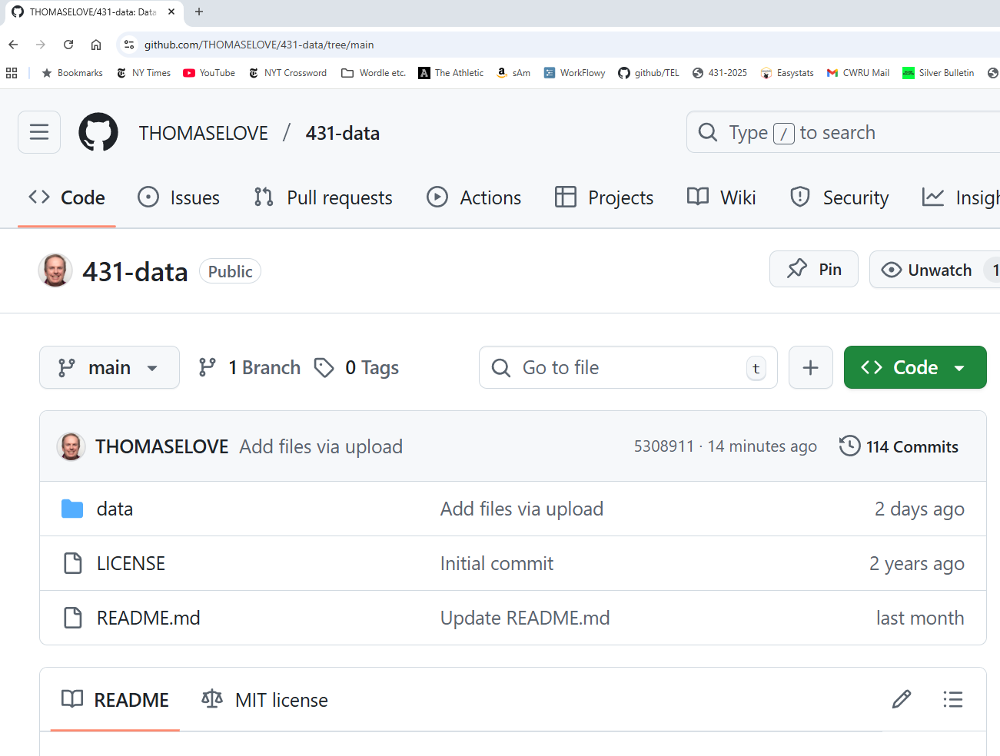
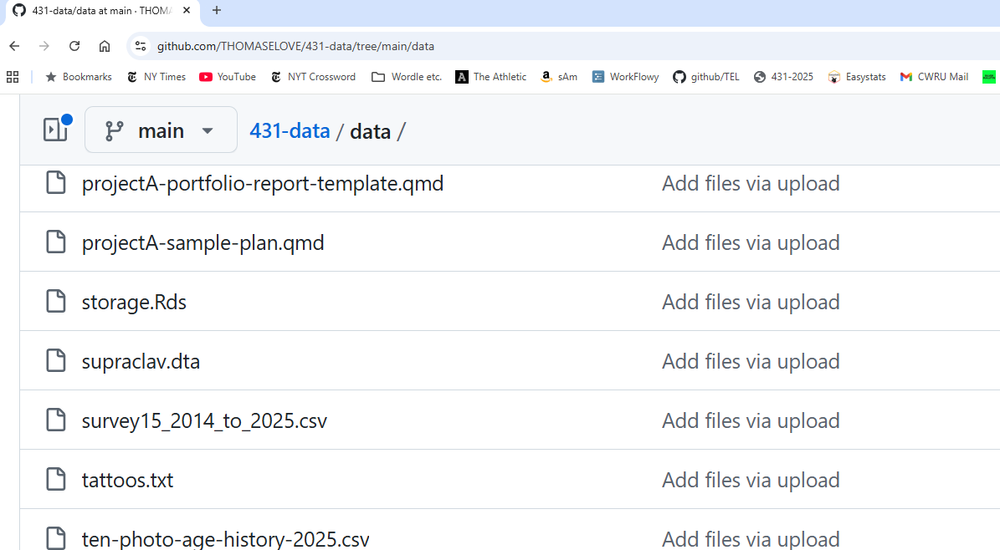
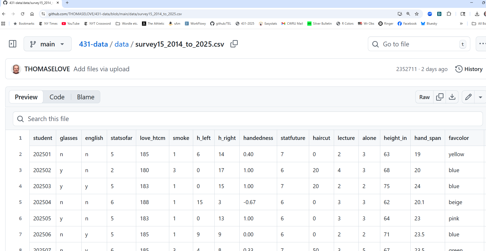
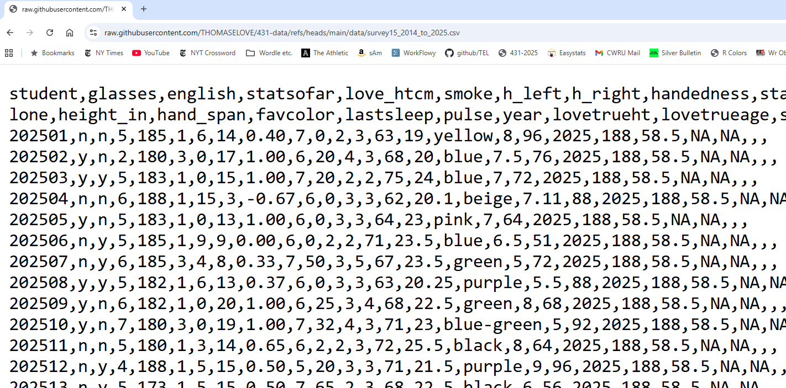
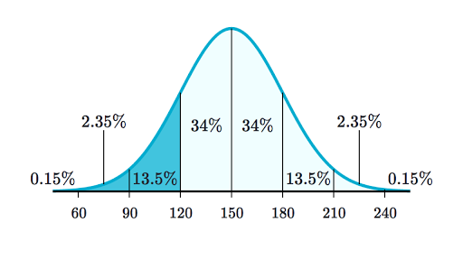

## Today's Agenda

- Work in R with a data set (15 question Class 02 survey)
- Open RStudio, load in data and a template to write code
  - We'll type only a little into the template today.
    - We'll then look at the completed Quarto document.
    - We'll also inspect and knit the Quarto file after all of the code is included.
  - Then we'll start over again with the slides.

These slides walk through everything in the Quarto document.

## Today's Files

From our [431-data page](https://github.com/THOMASELOVE/431-data), or our [Class 03 README (data folder)](https://github.com/THOMASELOVE/431-classes-2025/tree/main/class03/data), you should find:

- `431-first-r-template.qmd`
- `survey15_2014_to_2025.csv`

and

- `431-class03-all-code.qmd`

in addition to the usual slide materials.

## Today's Plan

We're using Quarto to gather together into a single document:

- the R code we build, 
- text commenting on and reacting to that R code, and 
- the output of the analyses we build.

Everything in these slides is also going into our Quarto file.


## Load packages and set theme

```{r}
#| echo: true
#| message: false

library(janitor)
library(patchwork)
library(easystats)
library(tidyverse)

theme_set(theme_bw())
knitr::opts_chunk$set(comment = NA)
```

Loading packages in R is like opening up apps on your phone. We need to tell R that, in addition to the base functions available in the software, we also have other functions we want to use. 

- Why are we loading these packages, in particular?

## On the tidyverse meta-package

- We will use the series of packages called the `tidyverse` in every Quarto file we create.
    - The `tidyverse` was developed (in part) by Hadley Wickham, Chief Scientist at Posit (makers of RStudio).
    - `dplyr` for data wrangling, cleaning and transformation
    - `ggplot2` is our main visualization package
    - other `tidyverse` packages help import data, work with factors and other common activities.
    
## More on today's packages

- The `janitor` package has some tools for examining, cleaning and tabulating data (including `tabyl()` and `clean_names()`) that we'll use regularly.
- The `patchwork` package will help us show multiple `ggplots` together.
- The `easystats` meta-package contains several other packages that will help us (especially) with building models and presenting our results.
- It's helpful to load the `tidyverse` package last.

## Today's Data

Our data come from the Quick 15-item Survey we did in Class 02 ([pdf in Class 02 README](https://github.com/THOMASELOVE/431-classes-2025/blob/main/class02/431_surveyhandout_1perstudent_2025-09-04.pdf)), which we've done (in various forms) since 2014. 

- A copy of these data (in .csv format) is on our [431-data page](https://github.com/THOMASELOVE/431-data), and also linked on our [Class 03 README](https://github.com/THOMASELOVE/431-classes-2025/tree/main/class03/data).

So first, let's ingest the data into R.

# Ingesting the data into R

## Our 431-data page



## We want `survey15_2014_to_2025.csv`



## Get the Raw version



## Raw .csv file suitable for saving



- So <https://raw.githubusercontent.com/THOMASELOVE/431-data/refs/heads/main/data/survey15_2014_to_2025.csv> is the URL we want.

## Tell R what URL you want to use

```{r}
#| echo: true

url_raw <- 
  "https://raw.githubusercontent.com/THOMASELOVE/431-data/refs/heads/main/data/survey15_2014_to_2025.csv"
```

- We assign the URL to `url_raw` with `<-`.
- This way, we have a shorter name to type.
- We're going to ingest these data into a file called `surv15_raw`.

## Read in data from our `.csv` file

```{r}
#| echo: true

surv15_raw <- 
  read_csv(url_raw, show_col_types = FALSE) |>
  janitor::clean_names()
```

- The `<-` assignment arrow creates `surv15_raw`
- We use `read_csv` to read in the `survey15_2014_to_2025.csv` file from our [431-data page](https://github.com/THOMASELOVE/431-data).
- We use `show_col_types = FALSE` to suppress some unnecessary output describing the column types
- We use `clean_names()` from the janitor package
- We use the pipe `|>` to direct the information flow

## What is the result?

```{r}
#| echo: true
surv15_raw
```

## A more detailed look?

```{r}
#| echo: true
glimpse(surv15_raw)
```

# Six Key "Verbs" for Data Management

## 6 key data management "verbs"

- `filter()` chooses rows
- `select()` chooses columns
- `arrange()` sorts rows by values
- `mutate()` creates new columns
- `group_by()` manipulates groups of data
- `summarize()` provides numerical summaries

All of these are in the `dplyr` package; part of the **tidyverse**. See the [Data Transformation chapter of R4DS](https://r4ds.hadley.nz/data-transform.html).

## `filter()`

We use the `filter()` function to change which rows are present in the data, without changing the order.

```{r}
#| echo: true
surv15_raw |> filter(year == "2025")
```

## `select()`

We use the `select()` function to change which columns are present...

```{r}
#| echo: true

surv15_raw |> select(student, glasses, lastsleep)
```

## `arrange()`

We use `arrange()` to change the order of the rows based on their values.

```{r}
#| echo: true
surv15_raw |> arrange(height_in) |> 
  select(student, height_in)
```

## `mutate()`

We use `mutate()` to add new columns calculated from the existing columns.

```{r}
#| echo: true
surv15_raw |> select(student, love_htcm, lovetrueht) |>
  mutate(ht_error = love_htcm - lovetrueht)
```

## `group_by()` and `summarize()`

We use `group_by()` to divide the data in groups of interest then use `summarize()` to obtain summaries.

```{r}
#| echo: true
surv15_raw |> 
  filter(complete.cases(height_in), year > 2018) |> 
  group_by(year) |> summarize(n(), median(height_in)) 
```

## Counting the `glasses` variable

```{r}
#| echo: true
surv15_raw |> count(glasses)
```

## Counting `glasses` and `english`

```{r}
#| echo: true
surv15_raw |> count(glasses, english)
```

## Favorite Color in 2025?

```{r}
#| echo: true
surv15_raw |>
    filter(year == "2025") |>
    tabyl(favcolor) |>
    adorn_pct_formatting()
```

## Using `summary()` on Quantities

```{r}
#| echo: true
surv15_raw |> 
  select(love_htcm, haircut, height_in, lastsleep) |>
  summary()
```

- Numerical summaries (five quantiles, plus the mean) for:
  - your guess of my height (in cm), last haircut price ($), your height (in inches), and last night's hours of sleep
- How many observations are available?

## More Descriptive Summaries

```{r}
#| echo: true
surv15_raw |>
  select(love_htcm, haircut, height_in, lastsleep) |>
  describe_distribution()
```

## Even More Descriptive Summaries

```{r}
#| echo: true
surv15_raw |>
  select(love_htcm, haircut, height_in, lastsleep) |>
  describe_distribution(centrality = "median")
```

# Manage the data into an analytic tibble called `surv15`

## Variables we'll look at closely today {.smaller}

We'll place these seven variables into our analytic data frame (tibble.)

-   `student`: student identification (numerical code)
-   `year`: indicates year when survey was taken (August)
-   `english`: y = prefers to speak English, else n
-   `smoke`: 1 = never smoker, 2 = quit, 3 = current
-   `pulse`: pulse rate (beats per minute)
-   `height_in`: student's height (in inches)
-   `haircut`: price of student's last haircut (in \$)

## Select our variables

```{r}
#| echo: true
surv15 <- surv15_raw |>
    select(student, year, english, smoke, 
           pulse, height_in, haircut)
```

- The `select()` function chooses the variables (columns) we want to keep in our new tibble called `surv15`.
- What should the result of this code look like?

## What do we have now?

```{r}
#| echo: true
dim(surv15)
surv15
```

## Initial Numeric Summaries

- Is everything the "type" of variable it should be? 
- Are we getting the summaries we want?

```{r}
#| echo: true
summary(surv15)
```

## What should we be seeing?

- Categorical variables should list the categories, with associated counts. 
  - To accomplish this, the variable needs to be represented in R with a `factor`, rather than as a `character` or `numeric` variable.
- Quantitative variables should show the minimum, median, mean, maximum, etc.

```{r}
#| echo: true
names(surv15)
```

## Categorical variables as factors

We want the `year` and `smoke` information treated as categorical, rather than as quantitative, and the `english` information as a factor, too. Also, do we want to summarize the student ID codes?

- We use the `mutate()` function to help with this.

```{r}
#| echo: true
surv15 <- surv15 |>
    mutate(year = as_factor(year),
           smoke = as_factor(smoke),
           english = as_factor(english),
           student = as.character(student))
```

- Note that it's `as_factor()` but `as.character()`. Sigh.

## Next step: Recheck the summaries and do range checks

-   Do these summaries make sense?
-   Are the minimum and maximum values appropriate?
-   How much missingness are we to deal with?

## Now, how's our summary?

```{r}
#| echo: true

summary(surv15)
```

- Some things to look for appear on the next slide.

## What to look for...

- Are we getting counts for all variables that are categorical?
    - Do the category levels make sense?
- Are we getting means and medians for all variables that are quantities?
    - Do the minimum and maximum values make sense for each of these quantities?
- Which variables have missing data, as indicated by `NA's`?

## The summary for `year` is an issue

- Just to fill in the gap left by the `summary()` result, how many students responded each year?

```{r}
#| echo: true
surv15 |> tabyl(year) |> adorn_totals() |> adorn_pct_formatting()
```

# Three Exploratory Questions

## Three Exploratory Questions

1. What is the distribution of pulse rates among students in 431 since 2014?
2. Does the distribution of student heights change materially over time?
3. Is the Normal distribution a good model for student heights? How about for student haircut prices?

# Question 1

## Question 1 

What is the distribution of pulse rates among students in 431 since 2014?

```{r}
#| echo: true
surv15 |> tabyl(pulse) |> adorn_pct_formatting()
```

## Histogram, first try

-   What is the distribution of student `pulse` rates?

```{r}
#| echo: true
#| warning: true
#| fig-height: 3

ggplot(data = surv15, aes(x = pulse)) +
    geom_histogram(bins = 15, fill = "royalblue",  col = "seagreen1")
```

## Describing the Pulse Rates

How might we describe this distribution?

- What is the center?
- How much of a range around that center do we see? How spread out are the data?
- What is the shape of this distribution?
    - Is it symmetric, or is it skewed to the left or to the right? 

(Histogram is replotted on the next slide)

## Histogram (with warning suppressed)

```{r}
#| echo: true
#| warning: false
ggplot(data = surv15, aes(x = pulse)) +
    geom_histogram(bins = 15, fill = "royalblue", col = "seagreen1")
```

## Some Key Numerical Summaries

```{r}
#| echo: true
surv15 |> select(pulse) |> summary()
```

```{r}
#| echo: true
length(surv15$pulse)
sd(surv15$pulse, na.rm = TRUE)
mad(surv15$pulse, na.rm = TRUE)
```

- Do these summaries help us describe the data?

## Histogram, version 2

```{r}
#| echo: true
#| output-location: slide

dat1 <- surv15 |>
  filter(complete.cases(pulse))

ggplot(data = dat1, aes(x = pulse)) +
    geom_histogram(fill = "seagreen", col = "white", bins = 20) +
    labs(title = "Pulse Rates of Dr. Love's students",
         subtitle = "2014 - 2025",
         y = "Number of Students",
         x = "Pulse Rate (beats per minute)")
```

- How did we deal with missing data?
- How did we add axis labels and titles to the plot?
- What is the distinction between `fill` and `col`?
- How many bins should we use?

# Question 2

## Question 2

Does the distribution of student heights change over time?

(Plot shown on next slide)

```{r}
#| echo: true
#| warning: true
#| output-location: slide

ggplot(surv15, aes(x = year, y = height_in)) +
  geom_point(alpha = 0.7, color = "forestgreen")
```


## Yearly Five-Number Summaries

```{r}
#| echo: true
#| eval: false
surv15 |>
    filter(complete.cases(height_in)) |>
    group_by(year) |>
    summarize(n = n(), min = min(height_in), q25 = quantile(height_in, 0.25),
              median = median(height_in), q75 = quantile(height_in, 0.75),
              max = max(height_in))
```

- What should this produce? (Results on next slide)

## Yearly Five-Number Summaries

```{r}
surv15 |>
    filter(complete.cases(height_in)) |>
    group_by(year) |>
    summarize(n = n(), min = min(height_in), q25 = quantile(height_in, 0.25),
              median = median(height_in), q75 = quantile(height_in, 0.75),
              max = max(height_in))
```

- Do these summaries change materially over time?
- What are these summaries, specifically?

## Five-Number Summary

- Key summaries based on percentiles / quantiles
    - minimum = 0th, maximum = 100th, median = 50th
    - quartiles (25th, 50th and 75th percentiles)
    - Range is maximum - minimum
    - IQR (inter-quartile range) is 75th - 25th percentile
- These summaries are generally more resistant to outliers than mean, standard deviation
- Form the elements of a boxplot (box-and-whisker plot)

## Boxplot of Heights by Year

```{r}
#| echo: true
#| output-location: slide

dat1 <- surv15 |>
    filter(complete.cases(height_in)) 

ggplot(data = dat1, aes(x = year, y = height_in)) +
    geom_boxplot() +
    labs(title = "Heights of Dr. Love's students, by year",
         subtitle = "2014 - 2025", x = "Year", y = "Height (in inches)")
```

- How did we deal with missing data here?

## Thinking about the Boxplot

- Box covers the middle half of the data (25th and 75th percentiles), and the solid line indicates the median
- Whiskers extend from the quartiles to the most extreme values that are not judged by **Tukey's** "fences" method to be candidate outliers
    - Fences are drawn at 25th percentile - 1.5 IQR and 75th percentile + 1.5 IQR
- Are any values candidate outliers by this method?
- Was it important to change `year` to a factor earlier?

## Adding a Violin to the Boxplot

- When we'd like to better understand the shape of a distribution, we can amplify the boxplot.

```{r}
#| echo: true
#| output-location: slide
dat1 <- surv15 |>
    filter(complete.cases(height_in))

ggplot(data = dat1, aes(x = year, y = height_in)) +
    geom_violin() +
    geom_boxplot(aes(fill = year), width = 0.3) +
    guides(fill = "none") +
    scale_fill_viridis_d(alpha = 0.3) +
    labs(title = "Heights of Dr. Love's students, by year",
         subtitle = "2014 - 2025", x = "Year", y = "Height (in inches)")
```

## Boxplot with Violin

- How did we change the boxplot when we added the violin?
- What would happen if we added the boxplot first and the violin second?
- What does `guides(fill = "none")` do?
- What does `scale_fill_viridis_d(alpha = 0.3)` do?

## Key Numerical Summaries

```{r}
#| echo: true

surv15 |>
    filter(complete.cases(height_in)) |>
    group_by(year) |>
    summarize(n = n(), mean = mean(height_in), sd = sd(height_in),
              median = median(height_in), mad = mad(height_in))
```

# Question 3

## Question 3 

Are the data on student heights in 2025 well described by a Normal distribution?

- Can we use a mean and standard deviation to describe the center and spread of the data effectively?

## A Normal distribution

This is a Normal (or Gaussian) distribution with mean 150 and standard deviation 30.



- A Normal distribution is completely specified by its mean and standard deviation. The "bell shape" doesn't change.

## Summarizing Quantitative Data

If the data followed a Normal model, 

- we would be justified in using the sample **mean** to describe the center, and
- in using the sample **standard deviation** to describe the spread (variation.)

But it is often the case that these measures aren't robust enough, because the data show meaningful skew (asymmetry), or the data have lighter or heavier tails than a Normal model would predict.


## The Empirical Rule for Approximately Normal Distributions 

If the data followed a Normal distribution,

- approximately 68% of the data would be within 1 SD of the mean, 
- approximately 95% of the data would be within 2 SD of the mean, while 
- essentially all (99.7%) of the data would be within 3 SD of the mean.

## Empirical Rule & 2025 Student Heights

```{r}
#| echo: true

dat2 <- surv15 |>
  filter(complete.cases(height_in),
         year == "2025")

describe_distribution(dat2$height_in)
```


In 2025, we had 53 students whose `height_in` was available, with mean 66.05 inches (167.8 cm) and standard deviation 3.65 inches (9.3 cm).

Consider a picture of the data...

## Histogram of 2025 Student Heights

```{r}
#| echo: true
#| output-location: slide

dat2 <- surv15 |>
  filter(complete.cases(height_in)) |>
  filter(year == "2025")

ggplot(data = dat2, aes(x = height_in)) +
    geom_histogram(fill = "salmon", col = "white", binwidth = 2) +
    labs(title = "Heights of Dr. Love's students",
         subtitle = "2025 (n = 53 students with height data)",
         y = "Number of Students", x = "Height (inches)")
```

- How did we use the two `filter()` statements?
- Why might I have changed from specifying `bins` to `binwidth` here?

## Checking the 1-SD Empirical Rule

- Of the 53 students in 2025 with heights, how many were within 1 SD of the mean?
  - Mean = 66.05, SD = 3.65.
  - 66.05 - 3.65 = 62.4; 66.05 + 3.65 = 69.7 inches

```{r}
#| echo: true

surv15 |> filter(complete.cases(height_in)) |>
    filter(year == "2025") |>
    count(height_in >= 62.4 & height_in <= 69.7)

33/(33+20)
```

## 2-SD Empirical Rule

- How many of the 53 `height_in` values gathered in 2025 were between 66.05 - 2(3.65) = 58.75 and 66.05 + 2(3.65) = 73.35 inches?

```{r}
#| echo: true
surv15 |> filter(complete.cases(height_in)) |>
    filter(year == "2025") |>
    count(height_in >= 58.75 & height_in <= 73.35)

52/(52+1)
```

## 3-SD Empirical Rule

- How many of the 53 `height_in` values gathered in 2025 were between 66.05 - 3(3.65) = 55.1 and 66.05 + 3(3.65) = 77.0 inches?

```{r}
#| echo: true
surv15 |> filter(complete.cases(height_in)) |>
    filter(year == "2025") |>
    count(height_in >= 55.1 & height_in <= 77.0)

53/(53+0)
```

## Empirical Rule Table for 2025 data

- $\bar{x}$ = sample mean, $s$ = sample SD
- For `height_in`: $n$ = 53 with data, $\bar{x} = 66.05, s = 3.45$
- For `haircut`: $n$ = 53 with data, $\bar{x} = 38.4, s = 52.6$

Range | "Normal" | `height_in` | `haircut`
:----: | :---: | :-----: | :-------:
$\bar{x} \pm s$ | ~68% | $\frac{33}{53}$ = 62.3% | $\frac{48}{53}$ = 90.6%  
$\bar{x} \pm 2\times s$ | ~95% | $\frac{52}{53}$ = 98.1% |  $\frac{51}{53}$ = 96.2% 
$\bar{x} \pm 3\times s$ | ~99.7% | $\frac{53}{53}$ = 100% | $\frac{51}{53}$ = 96.2% 

## Boxplots: Height & Haircut Price

```{r}
#| echo: true
#| output-location: slide

dat2 <- surv15 |> filter(complete.cases(height_in), year == "2025")

p2 <- ggplot(data = dat2, aes(x = "height (inches)", y = height_in)) +
  geom_violin() + geom_boxplot(width = 0.3, fill = "tomato") +
  labs(title = "Boxplot of 2025 Student Heights", x = "")

dat3 <- surv15 |> filter(complete.cases(haircut), year == "2025")

p3 <- ggplot(data = dat3, aes(x = "haircut ($)", y = haircut)) +
  geom_violin() + geom_boxplot(width = 0.3, fill = "dodgerblue") +
  labs(title = "Boxplot of 2025 Haircut Prices", x = "")

p2 + p3 + 
  plot_annotation(title = "2025 15-Question Survey Data")
```

- What is `width = 0.3` doing? How about the `x` options?
- What am I doing with `p2 + p3 + plot_annotation`?
- What should this look like?

## Mean/SD vs. Median/MAD

If the data are approximately Normally distributed (like `height_in` and `pulse`) we can safely use the sample mean and standard deviation as summaries. If not, then ... 

- The median is a more robust summary of the center.
- For spread, try the median absolute deviation^[MAD scaled here to equal the standard deviation when data follow the Normal.].

Measure | Median | Mean | MAD | Std. Dev.
-------: | ----: | ----: | ----: | ----:
height_in | 67 | 67.2 | 4.5 | 3.7
haircut | 30 | 37.9 | 22.2 | 38.2

# Thoughts So Far

## Question 1 Thoughts

1. What is the distribution of pulse rates among students in 431 since 2014?
    - Fairly "normal" (bell-shaped) with mean 74 beats per minute and SD = 12.9 bpm.
    
```{r}
#| echo: false

dat1 <- surv15 |>
  filter(complete.cases(pulse))

ggplot(data = dat1, aes(x = pulse)) +
    geom_histogram(fill = "seagreen", col = "white", bins = 20) +
    labs(title = "Pulse Rates of Dr. Love's students",
         subtitle = "2014 - 2025",
         y = "Number of Students",
         x = "Pulse Rate (beats per minute)")
```    

## Question 2 Thoughts

2. Does the distribution of student heights change over time?
    - Somewhat. More recent classes display smaller median heights.
    
```{r}
#| echo: false
dat1 <- surv15 |>
    filter(complete.cases(height_in))

ggplot(data = dat1, aes(x = year, y = height_in)) +
    geom_violin() +
    geom_boxplot(aes(fill = year), width = 0.3) +
    guides(fill = "none") +
    scale_fill_viridis_d(alpha = 0.3) +
    labs(title = "Heights of Dr. Love's students, by year",
         subtitle = "2014 - 2025", x = "Year", y = "Height (in inches)")
```    
    
## Question 3 Thoughts

1. Are the data on student heights in 2025 well described by a Normal distribution?
    - To some extent, yes. Mean was 66.05 inches, SD = 3.65 inches, with median = 66 inches, MAD = 3.7 inches.
    
2. What about haircut prices?
    - Not well described by a Normal distribution. Some very large outliers, and many results gathered close to 0, which describes right skew, where the mean (38.36 USD) substantially exceeds the median (25.00 USD.) 

## Next Time

- Additional Exploration of the "15-Question Survey" data
- Dealing with categorical data
- Thinking about associations, and modeling them
- Comparing means / medians of two "paired" samples

## Session Information

```{r}
#| echo: true
xfun::session_info()
```
