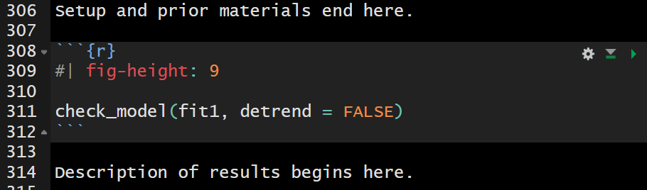

## Class 19 Agenda (last week)

1. Exploration and Initial Data Summaries
2. Dealing with Missing Data (today via Single Imputation)
3. Partitioning into Training and Testing Samples
4. How might we transform our outcome?
5. Building Three Candidate Prediction Models 
    - Assessing coefficients (model parameters)
    - Obtaining summaries of fit quality (performance)
6. Comparing some in-sample performance indices.

## Agenda for These Slides

1. Refitting the models from last time
2. `model_parameters()`: `include_info`, bootstrap CIs
3. Checking assumptions via `check_model()`
4. Prediction Errors: (MAPE, RMSPE, etc.)
    - Validated $R^2$ in test sample
5. Incorporating multiple imputation
6. Considering Bayesian alternative fits

## 431 strategy: "most useful" model?

1. Split the data into a development (model training) sample of about 70-80% of the observations, and a holdout (model test) sample, containing the remaining observations.
2. Develop candidate models using the development sample.
3. Assess the quality of fit for candidate models within the development sample.

## 431 strategy: "most useful" model?

4. Check adherence to regression assumptions in the development sample.
5. When you have candidates, assess them based on the accuracy of the predictions they make for the data held out (and thus not used in building the models.) 
6. Select a "final" model for use based on the evidence in steps 3, 4 and especially 5.

## R Packages

```{r}
#| echo: true

knitr::opts_chunk$set(comment = NA)

library(janitor)
library(naniar)
library(patchwork)
library(rstanarm)     # fit Bayesian models
library(mice)         # imputation
library(car)          # Box-Cox
library(GGally)       # scatterplot matrix
library(gt)           # pretty tables
library(broom)        # augmenting data with model results
library(easystats)
library(tidyverse)

source("c20/data/Love-431.R")

theme_set(theme_bw())
```

## `dm500` data again

```{r}
#| echo: true
dm500 <- readRDS("c20/data/dm500.Rds")

gt_preview(dm500, top_n = 6, bottom_n = 2)
```

## Same `dm500.Rds` Data

Outcome: `a1c` and we'll use three models ...

1. Model 1: Use `a1c_old` alone to predict `a1c`
2. Model 2: Use `a1c_old` and `age` together to predict `a1c`
3. Model 3: Use `a1c_old`, `age`, and `income` together to predict `a1c`

Today, we'll use 90% confidence, rather than 95%.

## Today's Single Imputation

We assume all missing values are Missing at Random (MAR) and create 10 imputations but for today, we'll switch things up and use a different **seed** and select the **4th** instead of the 7th imputation.

```{r}
#| echo: true
#| cache: true
#| label: tenimps

dm500_tenimps <- mice(dm500, m = 10, 
                      seed = 20251111, printFlag = FALSE)

dm500_i <- complete(dm500_tenimps, 4) |> tibble()

n_miss(dm500); n_miss(dm500_i)
```

## Train and Test Samples (new seed)

- Select a random sample (without replacement) of 70% of `dm500_i` (60-80% is common) for model training.
- Hold out the other 30% for model testing, using `anti_join()` to pull subjects not in `dm500_i_train`.

```{r}
#| echo: true
set.seed(2025431)

dm500_i_train <- dm500_i |> 
  slice_sample(prop = 0.7, replace = FALSE)
dm500_i_test <- 
  anti_join(dm500_i, dm500_i_train, by = "subject")

c(nrow(dm500_i_train), nrow(dm500_i_test), nrow(dm500_i))
```

## Distribution of `a1c` (outcome)

```{r}
#| echo: true
#| output-location: slide
p1 <- ggplot(dm500_i_train, aes(x = a1c)) +
  geom_histogram(binwidth = 0.5, 
                 fill = "slateblue", col = "white")

p2 <- ggplot(dm500_i_train, aes(sample = a1c)) + 
  geom_qq(col = "slateblue") + geom_qq_line(col = "violetred") +
  labs(y = "Observed a1c", x = "Normal (0,1) quantiles") + 
  theme(aspect.ratio = 1)

p3 <- ggplot(dm500_i_train, aes(x = "", y = a1c)) +
  geom_violin(fill = "slateblue", alpha = 0.1) + 
  geom_boxplot(fill = "slateblue", width = 0.3, notch = TRUE,
               outlier.color = "slateblue", outlier.size = 3) +
  labs(x = "") + coord_flip()

p1 + p2 - p3 +
  plot_layout(ncol = 1, height = c(3, 2)) + 
  plot_annotation(title = "Hemoglobin A1c values (%)",
         subtitle = str_glue("Model Development Sample: ", nrow(dm500_i_train), 
                           " adults with diabetes"))
```

## Box-Cox still suggests inverse?

```{r}
#| echo: true
mod_0 <- lm(a1c ~ a1c_old + age + income, 
            data = dm500_i_train)
boxCox(mod_0) ## from car package
```

## Scatterplot Matrix 

- Rescale inverse transformation with 100/A1c for `transa1c`.

```{r}
#| echo: true
#| output-location: slide
temp <- dm500_i_train |> 
  mutate(transa1c = 100/a1c) |>
  select(a1c_old, age, income, transa1c)

ggpairs(temp, 
    title = "Scatterplots: Model Development Sample",
    lower = list(combo = wrap("facethist", bins = 10)))
```

## Fit the three models

- We continue to use the model training sample, and work with the (100/a1c) transformation.

```{r}
#| echo: true

dm500_i_train <- dm500_i_train |> mutate(transa1c = 100/a1c)

fit1 <- lm(transa1c ~ a1c_old, data = dm500_i_train)
fit2 <- lm(transa1c ~ a1c_old + age, data = dm500_i_train)
fit3 <- lm(transa1c ~ a1c_old + age + income, 
            data = dm500_i_train)

c(n_obs(fit1), n_obs(fit2), n_obs(fit3))
```

## Estimated coefficients (`fit1`)

- 90% confidence intervals, rather than 95% today.
- Notice what `include_info = TRUE` does.

```{r}
#| echo: true
model_parameters(fit1, ci = 0.90, pretty_names = FALSE,
                 include_info = TRUE)
```

## Making this prettier?

```{r}
#| echo: true

model_parameters(fit1, ci = 0.90, pretty_names = FALSE,
                 include_info = TRUE) |>
  print_md()
```


## Can we use bootstrap CIs?

```{r}
#| echo: true
set.seed(431)
model_parameters(fit1, ci = 0.90, pretty_names = FALSE,
                 bootstrap = TRUE, iterations = 1000)
```

Compare to our t-based intervals:

```{r}
#| echo: true
model_parameters(fit1, ci = 0.90)
```

- What does `pretty_names = FALSE` do?

## `fit2` parameters

```{r}
#| echo: true

model_parameters(fit2, ci = 0.90, pretty_names = FALSE,
                 include_info = TRUE) 
```

## `fit3` parameters

```{r}
#| echo: true

model_parameters(fit3, ci = 0.90, pretty_names = FALSE,
                 include_info = TRUE) 
```

## `fit1` performance

```{r}
#| echo: true

model_performance(fit1)
```

```{r}
#| echo: true

model_performance(fit1, metrics = "common") |> 
  print_md(digits = 3)
```

## Compare Fit Quality 

- Same results^[`compare_performance()` weights AIC / BIC so higher values mean better fit.] as last week?

```{r}
#| echo: TRUE

compare_performance(fit1, fit2, fit3, rank = TRUE)
```

## Performance Comparison

```{r}
#| echo: TRUE

plot(compare_performance(fit1, fit2, fit3))
```

# Assumption Checking (done in the Training Sample)

## Assessing the models with `check_model()`

Three key assumptions we need to think about:

1. Linearity
2. Constant Variance (Homoscedasticity)
3. Normality

How do we assess 1, 2, and 3? Residual plots.

## In the slides, these are too short!

```{r}
#| echo: true
check_model(fit1, detrend = FALSE)
```

## Fixing the "too short" problem?



- Note where the blank lines are and where they **are not**.
- Check the result in your HTML!


## `fit1`: Linearity & Homoscedasticity

```{r}
#| echo: true
check_model(fit1, check = c("linearity", "homogeneity"))
```

## `fit2`: Linearity & Homoscedasticity

```{r}
#| echo: true
check_model(fit2, check = c("linearity", "homogeneity"))
```

## `fit3`: Linearity & Homoscedasticity

```{r}
#| echo: true
check_model(fit3, check = c("linearity", "homogeneity"))
```

## Influential Observations in `fit1`?

```{r}
#| echo: true
check_model(fit1, check = "outliers")
```

## Looking at row 321?

```{r}
#| echo: true
dm500_i_train |> slice(321) |>
  gt() |> tab_options(table.font.size = 20)
```

## `augment` adds fits, residuals, etc.

from the `broom` package...

```{r}
#| echo: true

aug1 <- augment(fit1, data = dm500_i_train)
```

`aug1` includes all variables in `dm500_i_train` and also:

- `transa1c` = 100/`a1c`, transformed outcome `fit1` predicts
- `.fitted` = fitted (predicted) values of 100/`a1c`
- `.resid` = residual (observed - fitted outcome) values; larger residuals (positive or negative) mean poorer fit
- `.std.resid` = standardized residuals (residuals scaled to SD = 1, remember residual mean is already 0)

## What does `augment` give us?

`aug1` also includes:

- `.hat` statistic = measures *leverage* (larger values of `.hat` indicate unusual combinations of predictor values)
- `.cooksd` = Cook's distance (or Cook's d), a measure of the subject's *influence* on the model (larger Cook's d values indicate that removing the point will materially change the model's coefficients)
- plus `.sigma` = estimated $\sigma$ if this point is dropped from the model

## `augment` results

```{r}
#| echo: true

aug1 |> gt_preview(top_n = 7, bottom_n = 3)
```

## Summarizing our New Measures

for model `fit1`...

```{r}
#| echo: true

aug1 |> select(transa1c, .fitted:.std.resid) |>
  summary()
```

## `augment` results: row 321

for model `fit1`...

```{r}
#| echo: true

aug1 |> slice(321) |> gt() |> fmt_number(decimals = 2)
```

- We'll want `augment` results for `fit2` and `fit3` soon.

```{r}
#| echo: true

aug2 <- augment(fit2, data = dm500_i_train) 
aug3 <- augment(fit3, data = dm500_i_train) 
```

## Testing the largest outlier?

```{r}
#| echo: true

car::outlierTest(fit1)
```

A studentized residual is just another way to standardize the residuals that has some useful properties here. 

- No indication that having a maximum absolute value of 3.12 in a sample of `r nrow(aug1)` studentized residuals is a major concern about the Normality assumption, given the Bonferroni p-value = 0.693.

## Influential Observations in `fit2`?

```{r}
#| echo: true
check_model(fit2, check = "outliers")
```

## Influential Observations in `fit2`?

```{r}
#| echo: true
check_model(fit3, check = "outliers")
```

## Testing the largest outlier?

- Model `fit2`

```{r}
#| echo: true

outlierTest(fit2)
```

- Model `fit3`

```{r}
#| echo: true
outlierTest(fit3)
```

## Normality Check of `fit1` Residuals?

```{r}
#| echo: true
check_model(fit1, check = c("qq", "normality"), 
            detrend = FALSE)
```

## `fit1`: poorly fit points

```{r}
#| echo: true

which.max(aug1$.std.resid); which.min(aug1$.std.resid)
slice(aug1, c(111, 124)) |> gt() |> 
  fmt_number(columns = c(transa1c:.std.resid), decimals = 3)

aug1 |> arrange(desc(abs(.std.resid))) |> 
  head(3) |> gt() |> 
  fmt_number(columns = c(transa1c:.std.resid), n_sigfig = 3)
```

## Normality Check of `fit2` Residuals?

```{r}
#| echo: true
check_model(fit2, check = c("qq", "normality"), 
            detrend = FALSE)
```

## `fit2`: 8 poorly fit points

```{r}
#| echo: true

aug2 |> arrange(desc(abs(.std.resid))) |> 
  head(8) |> 
  gt() |> 
  fmt_number(columns = c(transa1c:.std.resid), decimals = 3)
```

## Normality Check of `fit3` Residuals?

```{r}
#| echo: true
check_model(fit3, check = c("qq", "normality"), 
            detrend = FALSE)
```

## `fit3`: 8 poorly fit points

```{r}
#| echo: true

aug3 |> arrange(desc(abs(.std.resid))) |> 
  head(8) |> 
  gt() |> 
  fmt_number(columns = c(transa1c:.std.resid), decimals = 3)
```

# Collinearity

## Checking for Collinearity

Collinearity refers to correlations between predictors. 

- Strong correlations between predictors can inflate the variance of our estimates, and also make it hard to distinguish effects attributable to correlated predictors.
- When we have multiple predictors (as in `fit2` and `fit3`) it is worth quantifying the extent to which our variances are inflated by collinearity.
- We can estimate the effect of collinearity directly through the `vif()` function in the `car` package, or ...

## `fit2`: Collinearity Check

```{r}
#| echo: true
check_collinearity(fit2)
```

- (generalized) variance inflation factors above 5 are worthy of our special attention

## Model `fit2` Check for Collinearity

```{r}
#| echo: true
check_model(fit2, check = "vif")
```

## `fit3`: Collinearity Check

```{r}
#| echo: true
check_collinearity(fit3)
```

- If there's no problem with collinearity in `fit3`, can there be a problem with collinearity in `fit2`, which contains a subset of the same predictors?

## Model `fit3` Check for Collinearity

```{r}
#| echo: true
check_model(fit3, check = "vif")
```

# Posterior Predictive Checks

## Posterior Predictive Check: `fit1`

```{r}
#| echo: true
check_model(fit1, check = "pp_check")
```

## `fit1`: Observed vs. Predicted

```{r}
#| echo: true

ggplot(aug1, aes(x = .fitted, y = transa1c)) +
  geom_point() +
  geom_abline(slope = 1, intercept = 0, 
              lwd = 2, lty = "dashed", col = "magenta") 
```

## `fit1`: Observed and Predicted

```{r}
#| echo: true
aug1 |> reframe(lovedist(transa1c))

aug1 |> reframe(lovedist(.fitted))

cor(aug1$transa1c, aug1$.fitted); cor(aug1$transa1c, aug1$.fitted)^2

r2(fit1)
```


## `fit1`: Predictions and Observed

```{r}
#| echo: true
#| output-location: slide

p1 <- ggplot(aug1, aes(x = .fitted, y = "")) +
  geom_violin() + 
  geom_boxplot(fill = "royalblue", alpha = 0.5, width = 0.3) + 
  xlim(0, 25) +
  stat_summary(fun = "mean", col = "red") +
  labs(title = "Predicted 100/A1c values (model fit1)", y = "")

p2 <- ggplot(aug1, aes(x = transa1c, y = "")) +
  geom_violin() + 
  geom_boxplot(fill = "mistyrose", alpha = 0.5, width = 0.3) + 
  xlim(0, 25) +
  stat_summary(fun = "mean", col = "red") +
  labs(title = "Observed 100/A1c values", y = "")

p1 / p2

```


## Posterior Predictive Check: `fit2`

```{r}
#| echo: true
check_model(fit2, check = "pp_check")
```

## `fit2`: Predictions and Observed

```{r}
#| echo: true
#| output-location: slide

p1 <- ggplot(aug2, aes(x = .fitted, y = "")) +
  geom_violin() + 
  geom_boxplot(fill = "royalblue", alpha = 0.5, width = 0.3) + 
  xlim(0, 25) +
  stat_summary(fun = "mean", col = "red") +
  labs(title = "Predicted 100/A1c values (model fit2)", y = "")

p2 <- ggplot(aug2, aes(x = transa1c, y = "")) +
  geom_violin() + 
  geom_boxplot(fill = "mistyrose", alpha = 0.5, width = 0.3) + 
  xlim(0, 25) +
  stat_summary(fun = "mean", col = "red") +
  labs(title = "Observed 100/A1c values", y = "")

p1 / p2

```

## `fit2`: Observed and Predicted

```{r}
#| echo: true
aug2 |> reframe(lovedist(transa1c))

aug2 |> reframe(lovedist(.fitted))

cor(aug2$transa1c, aug2$.fitted); cor(aug2$transa1c, aug2$.fitted)^2

r2(fit2)
```


## Posterior Predictive Check: `fit3`

```{r}
#| echo: true
check_model(fit3, check = "pp_check")
```


## `fit3`: Predictions and Observed

```{r}
#| echo: true
#| output-location: slide

p1 <- ggplot(aug3, aes(x = .fitted, y = "")) +
  geom_violin() + 
  geom_boxplot(fill = "royalblue", alpha = 0.5, width = 0.3) + 
  xlim(0, 25) +
  stat_summary(fun = "mean", col = "red") +
  labs(title = "Predicted 100/A1c values (model fit3)", y = "")

p2 <- ggplot(aug1, aes(x = transa1c, y = "")) +
  geom_violin() + 
  geom_boxplot(fill = "mistyrose", alpha = 0.5, width = 0.3) + 
  xlim(0, 25) +
  stat_summary(fun = "mean", col = "red") +
  labs(title = "Observed 100/A1c values", y = "")

p1 / p2

```

## `fit3`: Observed and Predicted

```{r}
#| echo: true
aug3 |> reframe(lovedist(transa1c))

aug3 |> reframe(lovedist(.fitted))

cor(aug3$transa1c, aug3$.fitted); cor(aug3$transa1c, aug3$.fitted)^2

r2(fit3)
```

# Extending to the Test Sample

## Making Predictions: Test Sample

- Create transformed outcome in test sample.
- For OLS fits, apply `augment()` to new data = test sample.

```{r}
#| echo: true

dm500_i_test <- dm500_i_test |> mutate(transa1c = 100/a1c)

aug1_test <- augment(fit1, newdata = dm500_i_test) |> 
  mutate(mod = "fit1")
aug2_test <- augment(fit2, newdata = dm500_i_test) |> 
  mutate(mod = "fit2")
aug3_test <- augment(fit3, newdata = dm500_i_test) |> 
  mutate(mod = "fit3")
```

Results on next slide...

## `augment` for each model

```{r}
#| echo: true

aug1_test |> head(2) |> gt() 
aug2_test |> head(2) |> gt() 
aug3_test |> head(2) |> gt() 
```

## Combine Augmented Results

```{r}
#| echo: true
temp12 <- bind_rows(aug1_test, aug2_test)
test_res <- bind_rows(temp12, aug3_test) |>
  relocate(subject, mod, a1c, everything()) |>
  arrange(subject, mod)

test_res |> head() |> gt() |> tab_options(table.font.size = 20)
```

## Calculating Prediction Errors

For each of our (OLS) models, we have:

- `a1c`, the outcome we actually care about
- `transa1c` = 100/`a1c`, the transformed outcome 
- `.fitted`, a predicted `transa1c` from the model

What we want is 

- `a1c_pred`, the predicted `a1c` using this model, and
- `a1c_error`, the error made in predicting `a1c`

## Back-Transformation

Each `.fitted` value is a prediction of 100/`a1c`.

$$
\frac{100}{a1c} = \mbox{.fitted}, \mbox{ so } \frac{1}{a1c} = \frac{\mbox{.fitted}}{100}, \mbox{ and so}\\
a1c = \frac{100}{\mbox{.fitted}}
$$

To get `a1c_pred` we need to back-transform our `.fitted` values, with 100/`.fitted`, it seems.

## Adding predicted A1c and error

- We add `a1c_pred`, the predicted `a1c` using this model, and
- `a1c_error` = error for this model in predicting `a1c`

```{r}
#| echo: true
test_res <- test_res |> 
  mutate(a1c_pred = 100/.fitted,
         a1c_error = a1c - a1c_pred)

test_res |> head(4) |> gt() 
```

## Summarize Errors for Each Fit

We'll look at four summary measures in 431...

1. MAPE = mean absolute prediction error
2. Max_APE = maximum absolute prediction error
3. RMSPE = square root of mean squared prediction error
4. Validated $R^2$ = squared correlation of predictions and outcome in the new data

Measures 1-3 are all in the same units as `a1c`, our outcome.

## Building our Four Summaries

The `test_res` tibble contains, for each model,

- `a1c`, the actual outcome value
- `a1c_pred`, the predicted outcome value
- `a1c_error` = `a1c` - `a1c_pred` = prediction error

```{r}
#| echo: true

test_summary <- test_res |> 
  group_by(mod) |>
  summarize(MAPE = mean(abs(a1c_error)),
            Max_APE = max(abs(a1c_error)),
            RMSE = sqrt(mean(a1c_error^2)),
            R2_val = cor(a1c, a1c_pred)^2)
```

## Table for Test-Sample Prediction

```{r}
#| echo: true
test_summary |> 
  gt() |> 
  fmt_number(decimals = 4) |> 
  tab_options(table.font.size = 24)
```

::: {.incremental}
- Which model is best, by these metrics? 
- `fit2` has smallest MAPE, Max_APE, RMSPE, and largest validated $R^2$
:::

## Putting this all together

- `fit1` includes `a1c_old`, `fit2` adds `age`, `fit3` adds income
- Similar model assumption issues (hard-to-ignore problem with linearity, maybe non-constant variance)
- **training** sample: `fit3` performed best on $R^2$  and RMSE, `fit1` was best on adjusted $R^2$, AIC, BIC and $\sigma$.
- **test** sample: `fit2` performed best on MAPE, Max(APE), RMSPE and validated $R^2$.
- Only modest differences between models on most metrics.

# I decided to choose Model `fit2`

## Complete Case Analysis

- **Project B Study 2**: Report the model building process, displaying conclusions from training sample (transformation decisions, fitted parameters with CIs and interpretations, comparison of performance metrics, checks of model assumptions) and from test sample (comparison of predictive error)

- Of course, here we did some imputation, so we'd need to do this all over again with complete cases to get these results.

## Simple Imputation

- **Project B Study 2**: Report the model building process, displaying conclusions from training sample (transformation decisions, fitted parameters with CIs and interpretations, comparison of performance metrics, checks of model assumptions) and from test sample (comparison of predictive error)

- Sometimes, we do some of the steps above without reporting them to the public, of course. But that's not the goal here.

## Model `fit2` using Single Imputation

Estimated using a single imputation in training sample.

```{r}
#| echo: true
model_parameters(fit2, ci = 0.90, 
                 pretty_names = FALSE,
                 include_info = TRUE)
```

## Incorporating Multiple Imputations

- **Same as Project B Study 2**: Report the model building process, displaying conclusions from training sample (transformation decisions, fitted parameters with CIs and interpretations, comparison of performance metrics, checks of model assumptions) and from test sample (comparison of predictive error)

- **New** Then **add** information on fitted parameters across the whole data set (not split into training and testing) after multiple (in this case, 10) imputations.

## Using Ten Imputations

`dm500_tenimps` contained `mice` results across 10 imputations, then we used the 4th in our work. Let's build a new set of results across the model we've settled on, with a fresh set of 10 imputations.

- The original data (with missing values) are in `dm500` - we need only to add our transformed outcome, 100/`a1c`.

```{r}
#| echo: true
#| cache: true
#| label: imps2
dm500 <- dm500 |> mutate(transa1c = 100/a1c)

imp2_fit <- dm500 |>
  mice(m = 10, seed = 431, print = FALSE) |>
  with(lm(transa1c ~ a1c_old + age)) |>
  pool()
```

## Estimates across 10 imputations

```{r}
#| echo: true

model_parameters(imp2_fit, ci = 0.90, 
                 pretty_names = FALSE)

pool.r.squared(imp2_fit)
pool.r.squared(imp2_fit, adjusted = TRUE)
```

# Bayesian model fits instead?

## Refit with Bayesian models?

What must we change to use Bayesian (`stan_glm`) fits?

1. Must create transformed outcome in data prior to fitting with `rstanarm()`.
2. Results are a bit different for `model_parameters()`
3. Results are a bit different for `model_performance()`
4. No real change for `check_model()`
5. No `augment()` function for `rstanarm()` fits.

## Refit with Bayesian models?

- Single imputation, default weakly informative priors

```{r}
#| echo: true
#| cache: true
#| label: stan-glm-fits
set.seed(20251111)

fit1B <- stan_glm(transa1c ~ a1c_old, 
                  data = dm500_i_train, refresh = 0)
fit2B <- stan_glm(transa1c ~ a1c_old + age, 
                  data = dm500_i_train, refresh = 0)
fit3B <- stan_glm(transa1c ~ a1c_old + age + income, 
            data = dm500_i_train, refresh = 0)
```

- By default, `stan_glm()` performs 4000 simulations from the joint distribution of parameters.

## Estimating `fit1B` Coefficients?

```{r}
#| echo: true

model_parameters(fit1B, ci = 0.90, pretty_names = FALSE, include_info = TRUE)
```

- ` : 0.378` indicates "Bayesian" $R^2$ value
- `pd` = [probability of direction](https://easystats.github.io/bayestestR/reference/p_direction.html), an index of effect existence, representing the certainty with which an effect goes in a particular direction.
- We want `Rhat` < 1.05 and `ESS` > 100.

## `fit2B` Coefficients?

```{r}
#| echo: true

model_parameters(fit2B, ci = 0.90, pretty_names = FALSE) |> 
  gt()
```

- [Rhat and ESS](https://mc-stan.org/rstan/reference/Rhat.html) are diagnostic metrics.
  - If Rhat < 1.05, model convergence is probably OK.
  - If ESS > 100, then estimates are usually reliable.

## `fit3B` Coefficients?

```{r}
#| echo: true

model_parameters(fit3B, ci = 0.90, 
                 pretty_names = FALSE) |> 
  gt()
```

## Model Performance with `fit1B`?

```{r}
#| echo: true

model_performance(fit1B) 
```

- `R2` = "unadjusted" Bayesian $R^2$ (see [r2_bayes](https://easystats.github.io/performance/reference/r2_bayes.html) for details)
- `R2_adjusted` = leave-one-out cross-validation (LOO) adjusted $R^2$, which is conceptually closer to our OLS adjusted $R^2$ than some other options.
- `RMSE` = root mean squared error, so lower values mean better fit.

## Bayesian Model Performance

```{r}
#| echo: true

model_performance(fit2B) 
```

- `Sigma` = residual standard deviation (95% of in-sample predictions should be within $\pm 2 \sigma$)
- `WAIC` = Widely Applicable Information Criterion. Lower WAIC values mean better fit.

## Bayesian Model Performance

```{r}
#| echo: true

model_performance(fit3B) 
```

- `ELPD` = expected log predictive density. Larger ELPD means better fit.
- `LOOIC` = leave-one-out cross-validation (LOO) information criterion. Lower LOOIC means better fit.
- `LOOIC_SE` = standard error of LOOIC

[Performance of Bayesian Models](https://easystats.github.io/performance/reference/model_performance.stanreg.html) describes more options.

## Performance in Training Sample?

```{r}
#| echo: true
#| cache: true
#| label: compare-perf-Bayes

compare_performance(fit1B, fit2B, fit3B, rank = TRUE) |> 
  gt() |> fmt_number(decimals = 3) |>
  tab_options(table.font.size = 20)
```

## Bayes Performance Indicators?

```{r}
#| echo: true

plot(compare_performance(fit1B, fit2B, fit3B, 
          metrics = c("WAIC", "R2", "RMSE")))
```

## Why not all the indicators?

```{r}
#| echo: true

plot(compare_performance(fit1B, fit2B, fit3B))
```

## Checking Bayesian `fit1B`

```{r}
#| echo: true

check_model(fit1B, detrend = FALSE)
```

## Checking Bayesian `fit2B`

```{r}
#| echo: true
check_model(fit2B, detrend = FALSE)
```

## Checking Bayesian `fit3B`

```{r}
#| echo: true
check_model(fit3B, detrend = FALSE)
```

## No `augment` from Bayes fits

The `augment()` function from **broom** doesn't work with Bayesian fits using `rstanarm()`. 

We still want to get our predicted (fitted) values and residuals for each observation in our training sample.

```{r}
#| echo: true
aug_1B <- dm500_i_train |>
  mutate(.fitted = predict(fit1B),
         .resid = transa1c - predict(fit1B))
aug_2B <- dm500_i_train |>
  mutate(.fitted = predict(fit2B),
         .resid = transa1c - predict(fit2B))
aug_3B <- dm500_i_train |>
  mutate(.fitted = predict(fit3B),
         .resid = transa1c - predict(fit3B))
```

## `fit2` model (OLS vs Bayes)

```{r}
#| echo: true
aug2 |> select(1:8) |> head(3)
aug_2B |> head(3)
```

## Bayes fit to test sample?

Everything is the same as OLS, except we'd have to work around the use of augment in our test data, but `predict()` can handle what we need, as below.

```{r}
#| echo: true
test_1B <- dm500_i_test |>
  mutate(a1c_pred = predict(fit1B, newdata = dm500_i_test),
         a1c_error = transa1c - a1c_pred,
         mod = "fit1B")
test_1B |> head(4) |> gt()
```

## Bayes fit to test sample?

```{r}
#| echo: true
test_2B <- dm500_i_test |>
  mutate(a1c_pred = predict(fit2B, newdata = dm500_i_test),
         a1c_error = transa1c - a1c_pred,
         mod = "fit2B")

test_3B <- dm500_i_test |>
  mutate(a1c_pred = predict(fit3B, newdata = dm500_i_test),
         a1c_error = transa1c - a1c_pred,
         mod = "fit3B")
```

## Combine test sample results

- For our Bayesian models...

```{r}
#| echo: true

temp12B <- bind_rows(test_1B, test_2B)
test_resB <- bind_rows(temp12B, test_3B) |>
  relocate(subject, mod, a1c, everything()) |>
  arrange(subject, mod)

testB_summary <- test_resB |> 
  group_by(mod) |>
  summarize(MAPE = mean(abs(a1c_error)),
            Max_APE = max(abs(a1c_error)),
            RMSE = sqrt(mean(a1c_error^2)),
            R2_val = cor(a1c, a1c_pred)^2)
```

## Test-Sample Predictions

- From our Bayes models

```{r}
#| echo: true

testB_summary |> gt() |> fmt_number(decimals = 4) |> 
  tab_options(table.font.size = 24)
```

- What's the winner among these?

## What's next?

- Do most of this again, including some additional bells and whistles, and some new data.

- Multiple imputation with Bayesian linear models is a topic for 432 (or later.)

## Session Information

```{r}
#| echo: true

xfun::session_info()
```

