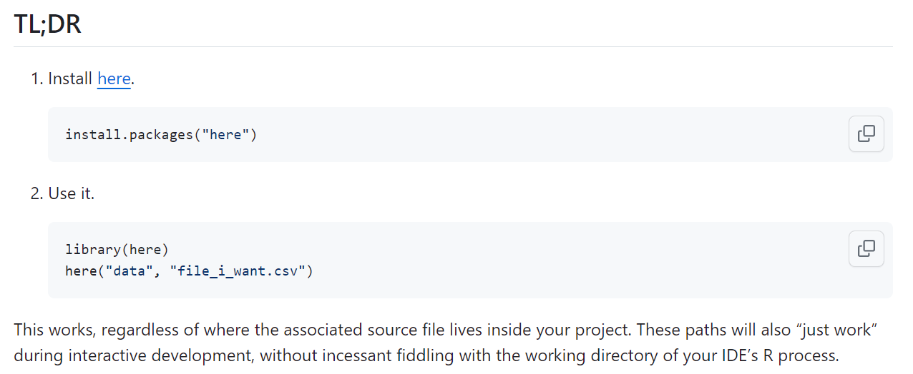
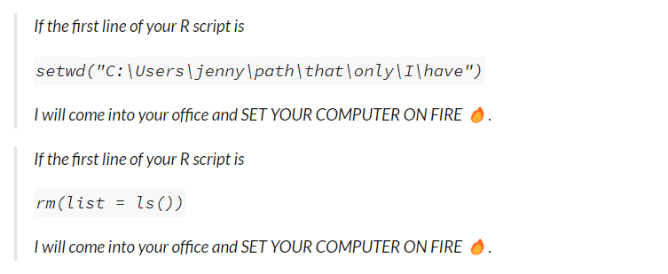

## Today's Agenda

- The **here** package and the **gtExtras** package are new.
- `df_stats()`: numerical summaries for a tibble.
- Example: `msleep` data from **ggplot2** in the **tidyverse**
  - Fitting and comparing linear models
  - Incorporating both single and multiple imputation

::: callout-note
Today's (arbitrary) confidence level = **89%**.
:::

## Today's Packages

```{r}
#| echo: true
#| message: false

library(here) ## new today
library(janitor)
library(naniar)
library(patchwork)
library(car)
library(mice)
library(gt)
library(gtExtras) ## new: some fancy gt themes
library(GGally)
library(mosaic) ## df_stats() for summaries
library(broom)
library(easystats)
library(tidyverse)

source(here("c21/data/Love-431.R"))

theme_set(theme_azurelight())
```

## The **here** package


## The **here** package

<https://here.r-lib.org/>

The **here** package creates paths relative to the top-level directory. The package displays the top-level of the current project on load or any time you call here():

```{r}
#| echo: true

here()
```

> The goal of the here package is to enable easy file referencing in [project-oriented workflows](https://rstats.wtf/projects.html). In contrast to using `setwd()`, which is fragile and dependent on the way you organize your files, here uses the top-level directory of a project to easily build paths to files.


## Jenny Bryan's [Ode to the here package](https://github.com/jennybc/here_here)



## Jenny Bryan on [Project-oriented workflow](https://www.tidyverse.org/blog/2017/12/workflow-vs-script/)



## R projects and `here()`

1.  Organize each project into a folder on your computer.
2.  Make sure the top-level folder advertises itself as such. If you use RStudio and/or Git, those both leave characteristic files that do that.
3.  Use the `here()` function to build the path when you read or write a file, relative to the top-level directory.
4.  Whenever you work on this project, launch RStudio from the project’s top-level directory.

# Mammals and How They Sleep

## Mammals sleep data (`msleep`)

```{r}
#| echo: true
gt_preview(msleep) |> tab_options(table.font.size = 18)
```

-   <https://ggplot2.tidyverse.org/reference/msleep.html> has details.

## `msleep` Variables of Interest

|      Variable | Description                              |
|--------------:|:-----------------------------------------|
|        `name` | Common name of mammal                    |
|        `vore` | Carni-, insecti-, herbi- or omnivore     |
|     `brainwt` | brain weight in kilograms                |
|      `bodywt` | body weight in kilograms                 |
|   `sleep_rem` | REM sleep, in hours                      |
| `sleep_total` | total amount of sleep, in hours          |
|       `awake` | (**outcome**) time spent awake, in hours |

## Modeling Plan

::: callout-note
Note that `awake` = 24 - `sleep_total`.
:::

Goal: Model `awake` with 4 pieces of information:

-   the type of food the mammal consumes (`vore`)
-   the weight of the mammal's brain (`brainwt`)
-   the weight of the mammal's body (`bodywt`), and
-   the proportion of total time asleep spent in REM sleep (`sleep_rem` / `sleep_total`)

## Create `ms431` data

```{r}
#| echo: true
ms431 <- msleep |>
  mutate(rem_prop = sleep_rem / sleep_total) |>
  select(name, awake, vore, brainwt, bodywt, rem_prop) |>
  mutate(vore = fct_infreq(vore))

gt_preview(ms431, top_n = 5, bottom_n = 2) |>
  tab_options(table.font.size = 18) |>
  fmt_number(col = brainwt:rem_prop, n_sigfig = 3) |>
  gt_theme_guardian()
```

## Change `vore` to use 3 levels

```{r}
#| echo: true
ms431 |> tabyl(vore) |> adorn_pct_formatting()

ms431 <- ms431 |> mutate(vore3 = fct_lump_n(vore, n = 2))

ms431 |> tabyl(vore, vore3) |> adorn_title(placement = "combined")
```

## Scatterplot Matrix (Problem?)

```{r}
#| echo: true
ggpairs(ms431 |> select(vore3, brainwt, bodywt, rem_prop, awake),
  title = "Are body weight and brain weight too highly correlated?",
  lower = list(combo = wrap("facethist", bins = 10)))
```

## Correlation (`bodywt`, `brainwt`)

```{r}
#| echo: true

ms431 |> select(bodywt, brainwt) |> correlation(ci = 0.89)
```

-   Potentially huge collinearity problem
-   Both `bodywt` and `brainwt` are extremely right-skewed

## Add in `brain_prop` = `brainwt`/`bodywt`

-   If we switch to `brain_prop` and `bodywt` as our predictors, do we still have a collinearity problem?

```{r}
#| echo: true

ms431 <- ms431 |> mutate(brain_prop = brainwt / bodywt)

ms431 |> select(bodywt, brainwt, brain_prop) |> correlation(ci = 0.89)
```

## Modeling Plan, Revised

Model `awake` using these four variables:

-   `vore3` (omni-, herbi-, Other)
-   `bodywt` (in kg)
-   `brain_prop` = (`brainwt` / `bodywt`)
-   `rem_prop` = (`sleep_rem` / `sleep_total`)

```{r}
#| echo: true
ms431 <- ms431 |>
  select(awake, vore3, bodywt, brain_prop, rem_prop, name)
```

# Missing Data?

## Are there missing data?

```{r}
#| echo: true
miss_var_summary(ms431) |> filter(n_miss > 0) |>  gt() |>
  tab_options(table.font.size = 18) |> gt_theme_dark()

miss_case_table(ms431) |> gt() |> tab_options(table.font.size = 18) |>
  fmt_number(columns = pct_cases, decimals = 2) |> gt_theme_dark()
```

## Missing Data Mechanisms {.smaller}

-   **Missing completely at random** There are no systematic differences between the missing values and the observed values.
    -   For example, blood pressure measurements may be missing because of breakdown of an automatic sphygmomanometer.
-   **Missing at random** Any systematic difference between the missing and observed values can be explained by other observed data.
    -   For example, missing BP measurements may be lower than measured BPs but only because younger people more often have a missing BP.
-   **Missing not at random** Even after the observed data are accounted, systematic differences remain between missing and observed values.
    -   For example, people with high BP may be more likely to have headaches that cause them to miss clinic appointments.

"Missing at random" is an **assumption** that justifies the analysis, rather than a property of the data.

## What assumption should we use?

Little's test, with $H_0$: data are MCAR

```{r}
#| echo: true
mcar_test(ms431) ## naniar provides this function
```

**If** we had a small $p$ value for the $\chi^2$ test statistic, we would conclude that the `ms431` data are not MCAR.

::: callout-tip
## Reference

Little, Roderick J. A. 1988. "A Test of Missing Completely at Random for Multivariate Data with Missing Values." *Journal of the American Statistical Association* 83 (404): 1198–1202. [doi:10.1080/01621459.1988.10478722](https://www.tandfonline.com/doi/abs/10.1080/01621459.1988.10478722).
:::

## If not MCAR, then what?

Suppose we assume that the data are MAR. This suggests the need for imputation of missing values.

::: callout-note
If we were willing to assume MCAR, we could also do a complete case analysis, but imputation might help a bit with power.
:::

Here, we have complete data on our outcome (`awake`) and `bodywt` so we won't need to impute them.

-   We will need to impute `vore3` (7), `brain_prop` (27) and `rem_prop` (22) from our sample of 83 mammals.
-   `vore3` is a factor, the others are quantities.

## Single Imputation

We'll use a singly imputed data set to select predictors.

```{r}
#| echo: true

set.seed(12345)
ms431_imp1 <- mice(ms431, m = 1, printFlag = FALSE)
ms431_imp <- complete(ms431_imp1)

prop_complete(ms431)
prop_complete(ms431_imp)
```

::: callout-note
After we've settled on a final prediction model using `ms431_imp`, we'll implement multiple imputation.
:::

# Consider Transformations?

## Scatterplot Matrix: **ms431_imp**

```{r}
#| echo: true
ggpairs(ms431_imp |> select(vore3, brain_prop, bodywt, rem_prop, awake),
  title = "bodywt is enormously right-skewed",
  lower = list(combo = wrap("facethist", bins = 10)))
```

## Compare `bodywt` to log(`bodywt`)?

```{r}
#| echo: true
#| output-location: slide

p1 <- ggplot(ms431_imp, aes(sample = bodywt)) +
  geom_qq() +
  geom_qq_line(col = "purple") +
  labs(title = "Untransformed bodywt", 
       x = "Standard Normal Distribution",
       y = "Body Weight (kg)")

p2 <- ggplot(ms431_imp, aes(sample = log(bodywt))) +
  geom_qq() +
  geom_qq_line(col = "purple") +
  labs(title = "Log of bodywt",
       x = "Standard Normal Distribution",
       y = "log(Body Weight)")

p1 + p2
```

## *New* Scatterplot Matrix: **ms431_imp**

```{r}
#| echo: true

ms431_imp <- ms431_imp |> mutate(log_body = log(bodywt))
ggpairs(ms431_imp |> select(vore3, brain_prop, log_body, rem_prop, awake),
  title = "Any signs of big problems now?",
  lower = list(combo = wrap("facethist", bins = 10)))
```

## Outcome Transformation?

```{r}
#| echo: true

temp_fit <- lm(awake ~ log_body + brain_prop + rem_prop + vore3,
               data = ms431_imp)
boxCox(temp_fit)
```

## Range check of quantities

```{r}
#| echo: true
df_stats(~ awake + log_body + brain_prop + rem_prop, 
         data = ms431_imp) |>
  gt() |> fmt_number(columns = min:sd, decimals = 3) |>
  tab_options(table.font.size = 24) |> gt_theme_guardian()
```

## Exploring our factor in `ms431_imp`

```{r}
#| echo: true
ms431_imp |> tabyl(vore3) |> adorn_pct_formatting()
```

- Original data...

```{r}
#| echo: true
msleep |> tabyl(vore) |> adorn_pct_formatting()
```

## Should we rescale any predictors?

Fit the model with all four predictors, and look at coefficients:

```{r}
#| echo: true

fit_all <- lm(awake ~ log_body + brain_prop + rem_prop + vore3,
              data = ms431_imp)

model_parameters(fit_all, pretty_names = FALSE, ci = 0.89)
```

# Partition into test and training samples

## Distinct names for `ms431_imp`?

-   Do we have a unique name to identify each mammal?

```{r}
#| echo: true

n_distinct(ms431_imp$name) == nrow(ms431_imp) # compare numbers

near(n_distinct(ms431_imp$name), nrow(ms431_imp)) # tidyverse approach
```

- Does this look right?
- Did we need both of these approaches?

## Partitioning the sample

- Partition 70% into **training**, the others to **test**, while maintaining a similar distribution of `vore3` groups.

```{r}
#| echo: true
set.seed(20251113)
ms431_train <- slice_sample(ms431_imp, prop = 0.7, by = "vore3")
ms431_test <- anti_join(ms431_imp, ms431_train, by = "name")
ms431_train |> tabyl(vore3) |> adorn_pct_formatting() |> adorn_totals()
ms431_test |> tabyl(vore3) |> adorn_pct_formatting() |> adorn_totals()
```

# Four Models to Consider

## Four Models We'll Fit

Predicting `awake` with...

- Model `fit1`: A simple regression on `log_body`
- Model `fit2`: A model with `log_body` and `brain_prop`
- Model `fit3`: `log_body`, `brain_prop` and `rem_prop`
- Model `fit4`: All four predictors (including `vore3`)

using the `ms431_train` data (imputed)

## Model `fit1`

```{r}
#| echo: true
fit1 <- lm(awake ~ log_body, 
         data = ms431_train)
model_parameters(fit1, ci = 0.89, pretty_names = FALSE,
                 include_info = TRUE)
```

## Using `tidy()` from **broom**

```{r}
#| echo: true

tidy(fit1, conf.level = 0.89, conf.int = TRUE) |>
  gt() |> fmt_number(decimals = 2) |> gt_theme_guardian()

model_parameters(fit1, ci = 0.89, pretty_names = FALSE) |>
  gt() |> fmt_number(decimals = 2) |> gt_theme_guardian()
```

## Model `fit2`

```{r}
#| echo: true
fit2 <- lm(awake ~ log_body + brain_prop, 
         data = ms431_train)
model_parameters(fit2, ci = 0.89, pretty_names = FALSE,
                 include_info = TRUE)
```

## Model `fit3`

```{r}
#| echo: true
fit3 <- lm(awake ~ log_body + brain_prop + rem_prop, 
         data = ms431_train)
model_parameters(fit3, ci = 0.89, pretty_names = FALSE,
                 include_info = TRUE)
```

## Model `fit4`

```{r}
#| echo: true
fit4 <- lm(awake ~ log_body + brain_prop + vore3 + rem_prop,
         data = ms431_train)

model_parameters(fit4, ci = 0.89, pretty_names = FALSE,
                 include_info = TRUE)
```

## Model Performance?

```{r}
#| echo: true

model_performance(fit1)
```

- `glance()` function from **broom** package

```{r}
#| echo: true

glance(fit1) |> gt()
```


## Combining `glance()` results

```{r}
#| echo: true
bind_rows(glance(fit1) |> mutate(name = "fit1"),
          glance(fit2) |> mutate(name = "fit2"),
          glance(fit3) |> mutate(name = "fit3"),
          glance(fit4) |> mutate(name = "fit4")) |>
  select(name, r.squared, adj.r.squared, sigma, AIC, BIC, nobs, df) |>
  gt() |> fmt_number(decimals = 5, columns = 2) |>
    fmt_number(decimals = 4, columns = c(3:4)) |>
    fmt_number(decimals = 0, columns = c(5:6)) 
```

## Compare Models

```{r}
#| echo: true
compare_performance(fit1, fit2, fit3, fit4, rank = TRUE)
```

## Compare Models (in training sample)

```{r}
#| echo: true
plot(compare_performance(fit1, fit2, fit3, fit4))
```

# Checking Assumptions

## Check Assumptions? (`fit1`)

- These plots would be too short in the slides, but fine in HTML with `#|: fig-height: 9`, so I don't run them here.

```{r}
#| echo: true
#| eval: false

set.seed(43101); check_model(fit1, detrend = FALSE)
set.seed(43102); check_model(fit2, detrend = FALSE)
set.seed(43103); check_model(fit3, detrend = FALSE)
```

- We'll look at `fit4`'s `check_model()` plots in detail...

## First Two Plots for `fit4`

```{r}
#| echo: true
set.seed(43104)
check_model(fit4, detrend = FALSE, check = c("pp_check", "linearity"))
```

## Next Two Plots for `fit4`

```{r}
#| echo: true
set.seed(43104)
check_model(fit4, detrend = FALSE, check = c("homogeneity", "outliers"))
```

## Next Two Plots for `fit4`

```{r}
#| echo: true
set.seed(43104)
check_model(fit4, detrend = FALSE, check = c("vif", "qq"))
```

## `augment` for the 4 models

- We'll add fitted values (predicted values) and residuals to the data when predicting into the `ms431_test` data.

```{r}
#| echo: true

test_fit1 <- augment(fit1, newdata = ms431_test) |> mutate(mod = "fit1")
test_fit2 <- augment(fit2, newdata = ms431_test) |> mutate(mod = "fit2")
test_fit3 <- augment(fit3, newdata = ms431_test) |> mutate(mod = "fit3")
test_fit4 <- augment(fit4, newdata = ms431_test) |> mutate(mod = "fit4")

test_comp <- bind_rows(test_fit1, test_fit2, test_fit3, test_fit4) |>
  arrange(name, mod)
```

## Comparing Models: Test Sample

```{r}
#| echo: true
test_comp |> group_by(mod) |>
  summarize(n = n(), MAPE = mean(abs(.resid)), 
            RMSPE = sqrt(mean(.resid^2)),
            max_error = max(abs(.resid)),
            valid_R2 = cor(awake, .fitted)^2) |>
  gt() |> fmt_number(decimals = 3, columns = -"n") |>
  tab_options(table.font.size = 20)
```

- What should we pick here?

## Model 4 (training sample)

```{r}
#| echo: true
model_parameters(fit4, ci = 0.89, pretty_names = FALSE) |> 
  gt() |> tab_options(table.font.size = 20) |> 
  fmt_number(decimals = 3, columns = c(-CI, -df_error)) |>
  gt_theme_espn()
model_performance(fit4) |> gt() |> fmt_number(decimals = 3) |>
  tab_options(table.font.size = 20) |> gt_theme_guardian()
```

## Create Multiple Imputations

How many subjects have missing data that affect this model?

```{r}
#| echo: true
ms431_sub <- ms431 |>
  mutate(log_body = log(bodywt)) |>
  select(name, awake, log_body, brain_prop, rem_prop, vore3)

pct_miss_case(ms431_sub)
```

## We'll build 50 imputed data sets.

```{r}
#| echo: true
set.seed(4312345)
ms431_mice <- mice(ms431_sub, m = 50, printFlag = FALSE)
summary(ms431_mice)
```

## Run Model 4 on each imputation

```{r}
#| echo: true

fit4_mods <- with(ms431_mice, lm(awake ~ log_body + brain_prop + rem_prop + vore3))

summary(fit4_mods)
```

## Pool Results across imputations

```{r}
#| echo: true
fit4_pool <- pool(fit4_mods)
model_parameters(fit4_pool, ci = 0.89, pretty_names = FALSE) |> 
  gt() |> tab_options(table.font.size = 20) |> 
  fmt_number(decimals = 3, columns = c(-CI, -df_error)) |>
  gt_theme_espn()
```

## Estimate R-square and Adjusted R-square

```{r}
#| echo: true
pool.r.squared(fit4_mods)
pool.r.squared(fit4_mods, adjusted = TRUE)
```

## More Details on MI modeling

```{r}
#| echo: true
fit4_pool
```

## What if we picked model `fit1`?

```{r}
#| echo: true

fit1_mods <- with(ms431_mice, lm(awake ~ log_body))
fit1_pool <- pool(fit1_mods)
model_parameters(fit1_pool, ci = 0.89, pretty_names = FALSE) |> 
  gt() |> tab_options(table.font.size = 20) |> 
  fmt_number(decimals = 3, columns = c(-CI, -df_error)) |>
  gt_theme_espn()
pool.r.squared(fit1_mods)
```

## What if we picked model `fit2`?

```{r}
#| echo: true

fit2_mods <- with(ms431_mice, lm(awake ~ log_body + brain_prop))
fit2_pool <- pool(fit2_mods)
model_parameters(fit2_pool, ci = 0.89, pretty_names = FALSE) |> 
  gt() |> tab_options(table.font.size = 20) |> 
  fmt_number(decimals = 3, columns = c(-CI, -df_error)) |>
  gt_theme_espn()
pool.r.squared(fit2_mods)
```

## What if we picked model `fit3`?

```{r}
#| echo: true

fit3_mods <- with(ms431_mice, lm(awake ~ log_body + brain_prop + rem_prop))
fit3_pool <- pool(fit3_mods)
model_parameters(fit3_pool, ci = 0.89, pretty_names = FALSE) |> 
  gt() |> tab_options(table.font.size = 20) |> 
  fmt_number(decimals = 3, columns = c(-CI, -df_error)) |>
  gt_theme_espn()
pool.r.squared(fit3_mods)
```

## Guidelines for reporting, I (Sterne) {.smaller}

How should we report on analyses potentially affected by missing data?

-   Report the number of missing values for each variable of interest, or the number of cases with complete data for each important component of the analysis. Give reasons for missing values if possible, and indicate how many individuals were excluded because of missing data when reporting the flow of participants through the study. If possible, describe reasons for missing data in terms of other variables (rather than just reporting a universal reason such as treatment failure.)
-   Clarify whether there are important differences between individuals with complete and incomplete data, for example, by providing a table comparing the distributions of key exposure and outcome variables in these different groups
-   Describe the type of analysis used to account for missing data (e.g., multiple imputation), and the assumptions that were made (e.g., missing at random)

## Guidelines for reporting, II (Sterne) {.smaller}

How should we report on analyses that involve multiple imputation?

-   Provide details of the imputation modeling (software used, key settings, number of imputed datasets, variables included in imputation procedure, etc.)
-   If a large fraction of the data is imputed, compare observed and imputed values.
-   Where possible, provide results from analyses restricted to complete cases, for comparison with results based on multiple imputation. If there are important differences between the results, suggest explanations.
-   It is also desirable to investigate the robustness of key inferences to possible departures from the missing at random assumption, by assuming a range of missing not at random mechanisms in sensitivity analyses.

## Session Information

```{r}
#| echo: true
xfun::session_info()
```
