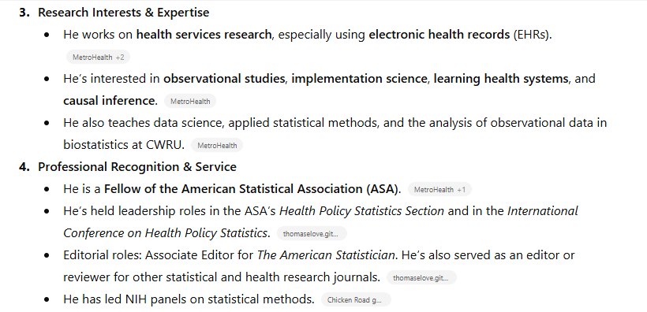
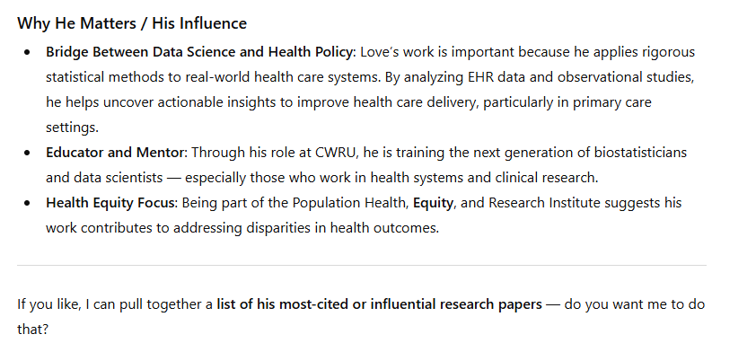
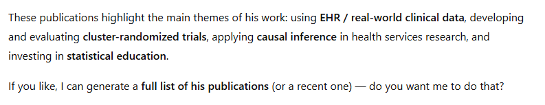
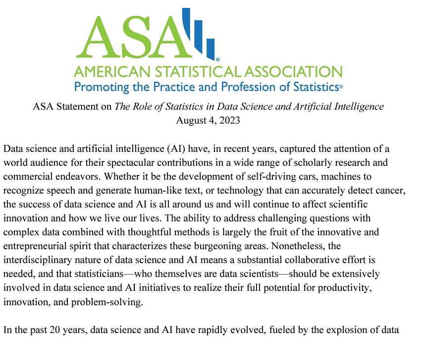

## Today's Agenda

1. Multiple Imputation in the `dm500` data
    - Comparing $R^2$ to adjusted $R^2$
2. Considering Bayesian alternative fits in the `dm500` data
    - Key steps in evaluating a Bayesian fit
    - Reasons to "go Bayesian"
3. ChatGPT and Large Language Models
4. ASA Statement on the Role of Statistics ion Data Science and AI (2023)

## R packages

```{r}
#| echo: true
#| message: false

knitr::opts_chunk$set(comment = NA)

library(janitor)
library(naniar)
library(mice)         
library(gt)           
library(broom)        
library(rstanarm)     
library(easystats)
library(tidyverse)

source("c23/data/Love-431.R")

theme_set(theme_lucid())
```

## Same `dm500.Rds` Data

Outcome: `a1c` and we'll use three models ...

1. Model 1: Use `a1c_old` alone to predict `a1c`
2. Model 2: Use `a1c_old` and `age` together to predict `a1c`
3. Model 3: Use `a1c_old`, `age`, and `income` together to predict `a1c`

Today, we'll use 90% confidence, rather than 95%.

## `dm500` management and 10 imputations

```{r}
#| echo: true
#| warning: false

dm500 <- readRDS("c20/data/dm500.Rds") |>
  mutate(transa1c = 100/a1c)

imp2_fit <- dm500 |>
  mice(m = 10, seed = 431, print = FALSE) |>
  with(lm(transa1c ~ a1c_old + age)) |>
  pool()
```

## $R^2$ vs. adjusted $R^2$?

```{r}
#| echo: true
glance(imp2_fit)

pool.r.squared(imp2_fit)
pool.r.squared(imp2_fit, adjusted = TRUE)
```

- $R^2$ will increase even with useless predictors, while adjusted $R^2$ penalizes the addition of such variables, causing it to decrease and show a large gap with the original $R^2$ value. 

## What is `fmi`?

- `fmi` refers to the fraction of missing information in multiple imputation

```{r}
#| echo: true
pool.r.squared(imp2_fit)
```

- Some people suggest using an initial estimate of `fmi`, based on, say, 20 imputations, to help determine how many imputations are needed overall to get accurate standard errors. 
- We'll follow up on that idea in 432.

# Bayesian model fits for `dm500` data (from Class 20)

## Refit with Bayesian models?

What must we change to use Bayesian (`stan_glm`) fits?

1. Must create transformed outcome in data prior to fitting with `rstanarm()`.
2. Results are a bit different for `model_parameters()`
3. Results are a bit different for `model_performance()`
4. No real change for `check_model()`
5. No `augment()` function for `rstanarm()` fits.

## Single Imputation & Partition

```{r}
#| echo: true
#| warning: false

dm500_i_set <- mice(dm500, m = 1, seed = 20251111, printFlag = FALSE)
dm500_i <- complete(dm500_i_set)

set.seed(2025431)
dm500_i_train <- dm500_i |> 
  slice_sample(prop = 0.7, replace = FALSE) |>
  mutate(transa1c = 100/a1c)

dm500_i_test <- 
  anti_join(dm500_i, dm500_i_train, by = "subject") |>
  mutate(transa1c = 100/a1c)
```

## Refit with Bayesian models?

- Single imputation, default weakly informative priors

```{r}
#| echo: true
#| label: stan-glm-fits

set.seed(20251111)

fit1B <- stan_glm(transa1c ~ a1c_old, 
                  data = dm500_i_train, refresh = 0)
fit2B <- stan_glm(transa1c ~ a1c_old + age, 
                  data = dm500_i_train, refresh = 0)
fit3B <- stan_glm(transa1c ~ a1c_old + age + income, 
            data = dm500_i_train, refresh = 0)
```

- By default, `stan_glm()` performs 4000 simulations from the joint distribution of parameters.

## Estimating `fit1B` Coefficients?

```{r}
#| echo: true

model_parameters(fit1B, ci = 0.90, pretty_names = FALSE, include_info = TRUE)
```

- ` : 0.384` indicates "Bayesian" $R^2$ value
- `pd` = [probability of direction](https://easystats.github.io/bayestestR/reference/p_direction.html), an index of effect existence, representing the certainty with which an effect goes in a particular direction.
- We want `Rhat` < 1.05 and `ESS` > 100.

## `fit2B` Coefficients?

```{r}
#| echo: true

model_parameters(fit2B, ci = 0.90, pretty_names = FALSE) |> 
  gt()
```

- [Rhat and ESS](https://mc-stan.org/rstan/reference/Rhat.html) are diagnostic metrics.
  - If Rhat < 1.05, model convergence is probably OK.
  - If ESS > 100, then estimates are usually reliable.

## `fit3B` Coefficients?

```{r}
#| echo: true

model_parameters(fit3B, ci = 0.90, 
                 pretty_names = FALSE) |> 
  gt()
```

## Model Performance with `fit1B`?

```{r}
#| echo: true

model_performance(fit1B) 
```

- `R2` = "unadjusted" Bayesian $R^2$ (see [r2_bayes](https://easystats.github.io/performance/reference/r2_bayes.html) for details)
- `R2_adjusted` = leave-one-out cross-validation (LOO) adjusted $R^2$, which is conceptually closer to our OLS adjusted $R^2$ than some other options.
- `RMSE` = root mean squared error, so lower values mean better fit.

## Bayesian Model Performance

```{r}
#| echo: true

model_performance(fit2B) 
```

- `Sigma` = residual standard deviation (95% of in-sample predictions should be within $\pm 2 \sigma$)
- `WAIC` = Widely Applicable Information Criterion. Lower WAIC values mean better fit.

## Bayesian Model Performance

```{r}
#| echo: true

model_performance(fit3B) 
```

- `ELPD` = expected log predictive density. Larger ELPD means better fit.
- `LOOIC` = leave-one-out cross-validation (LOO) information criterion. Lower LOOIC means better fit.
- `LOOIC_SE` = standard error of LOOIC

[Performance of Bayesian Models](https://easystats.github.io/performance/reference/model_performance.stanreg.html) describes more options.

## Performance in Training Sample?

```{r}
#| echo: true
#| label: compare-perf-Bayes

compare_performance(fit1B, fit2B, fit3B, rank = TRUE) |> 
  gt() |> fmt_number(decimals = 3) |>
  tab_options(table.font.size = 20)
```

## Bayes Performance Indicators?

```{r}
#| echo: true

plot(compare_performance(fit1B, fit2B, fit3B, 
          metrics = c("WAIC", "R2", "RMSE")))
```

## Why not all the indicators?

```{r}
#| echo: true

plot(compare_performance(fit1B, fit2B, fit3B))
```

## Checking Bayesian `fit1B`

```{r}
#| echo: true

check_model(fit1B, detrend = FALSE)
```

## Checking Bayesian `fit2B`

```{r}
#| echo: true
check_model(fit2B, detrend = FALSE)
```

## Checking Bayesian `fit3B`

```{r}
#| echo: true
check_model(fit3B, detrend = FALSE)
```

## No `augment` from Bayes fits

The `augment()` function from **broom** doesn't work with Bayesian fits using `rstanarm()`. 

We still want to get our predicted (fitted) values and residuals for each observation in our training sample.

```{r}
#| echo: true
aug_1B <- dm500_i_train |>
  mutate(.fitted = predict(fit1B),
         .resid = transa1c - predict(fit1B))
aug_2B <- dm500_i_train |>
  mutate(.fitted = predict(fit2B),
         .resid = transa1c - predict(fit2B))
aug_3B <- dm500_i_train |>
  mutate(.fitted = predict(fit3B),
         .resid = transa1c - predict(fit3B))
```

## Bayes fit to test sample?

Everything is the same as OLS, except that we don't have `augment()` for our test data, but `predict()` can handle this.

```{r}
#| echo: true
test_1B <- dm500_i_test |>
  mutate(a1c_pred = predict(fit1B, newdata = dm500_i_test),
         a1c_error = transa1c - a1c_pred,
         mod = "fit1B")
test_1B |> head(4) |> gt()
```

## Bayes fit to test sample?

```{r}
#| echo: true
test_2B <- dm500_i_test |>
  mutate(a1c_pred = predict(fit2B, newdata = dm500_i_test),
         a1c_error = transa1c - a1c_pred,
         mod = "fit2B")

test_3B <- dm500_i_test |>
  mutate(a1c_pred = predict(fit3B, newdata = dm500_i_test),
         a1c_error = transa1c - a1c_pred,
         mod = "fit3B")
```

## Combine test sample results

- For our Bayesian models...

```{r}
#| echo: true

temp12B <- bind_rows(test_1B, test_2B)
test_resB <- bind_rows(temp12B, test_3B) |>
  relocate(subject, mod, a1c, everything()) |>
  arrange(subject, mod)

testB_summary <- test_resB |> 
  group_by(mod) |>
  summarize(MAPE = mean(abs(a1c_error)),
            Max_APE = max(abs(a1c_error)),
            RMSE = sqrt(mean(a1c_error^2)),
            R2_val = cor(a1c, a1c_pred)^2)
```

## Test-Sample Predictions

- From our Bayes models

```{r}
#| echo: true

testB_summary |> gt() |> fmt_number(decimals = 4) |> 
  tab_options(table.font.size = 24)
```

- Are any of these models **dominated** by another?

# ChatGPT and Large Language Models: Taking Stock

## ChatGPT


<https://chat.openai.com/>

## ChatGPT response March 2023


## ChatGPT 3.5 response November 2023


## ChatGPT "conversation" 2025-11-16


## ChatGPT "conversation" 2025-11-16


## ChatGPT "conversation" 2025-11-16


## ChatGPT "conversation" 2025-11-16


## ChatGPT "conversation" 2025-11-16


## ChatGPT "conversation" 2025-11-16


## ChatGPT "conversation" 2025-11-16



## ChatGPT "conversation" 2025-11-16


## ChatGPT "conversation" 2025-11-16



## ChatGPT "conversation" 2025-11-16

- Generates a list of 5 publications, all of which I am proud of, though only 1, 2 and 5 would be in my top 5...



## ASA Statement (2023-08-04)



:::{.callout-tip}
# Reference

<https://www.amstat.org/docs/default-source/amstat-documents/the-role-of-statistics-in-data-science-and-artificial-intelligence.pdf>
:::

## ASA Statement Excerpt 1 {.smaller}

[The Role of Statistics in Data Science and Artificial Intelligence](https://www.amstat.org/docs/default-source/amstat-documents/the-role-of-statistics-in-data-science-and-artificial-intelligence.pdf) (pdf): 2023-08-04

> Statistics plays a central role in data science and AI, especially in the areas of ML and deep learning. Framing questions statistically allows leveraging data resources to extract knowledge and obtain better answers. The central dogma of statistical inference, that there is a component of randomness in data, enables researchers to formulate questions in terms of underlying processes, quantify uncertainty in their answers, and separate signal from noise. A statistical framework allows researchers to distinguish between causation and correlation, and thus to identify interventions that will cause changes in outcomes.

## ASA Statement Excerpt 2 {.smaller}

[The Role of Statistics in Data Science and Artificial Intelligence](https://www.amstat.org/docs/default-source/amstat-documents/the-role-of-statistics-in-data-science-and-artificial-intelligence.pdf) (pdf): 2023-08-04

> The future of data science and AI is uncertain, but one thing is clear: the field will undoubtedly continue to evolve rapidly and have a profound impact on society. As a result, the role of statisticians will also be subject to change and expansion, as they must adapt to new technologies and tools while continuing to provide expertise in traditional areas of statistics such as uncertainty quantification, sampling design, and causal inference. The need for interdisciplinary collaboration and a diverse range of skills will become increasingly important for statisticians to remain relevant in this dynamic and ever-changing field.

## Statistics and AI

"Statistics and AI: A Fireside Conversation"

- 3-hour webinar held on 2024-03-17, including:
    - Statistical challenges and opportunities (Panel I)
    - The evolving publication process in the AI era (Panel II)
    - Advancing next-generation statistical pipelines and resources (Panel III)

Full recording is on the [Stats Up AI YouTube channel](https://www.youtube.com/@StatsUpAI/videos).

## Session Information

```{r}
#| echo: true

xfun::session_info()
```

