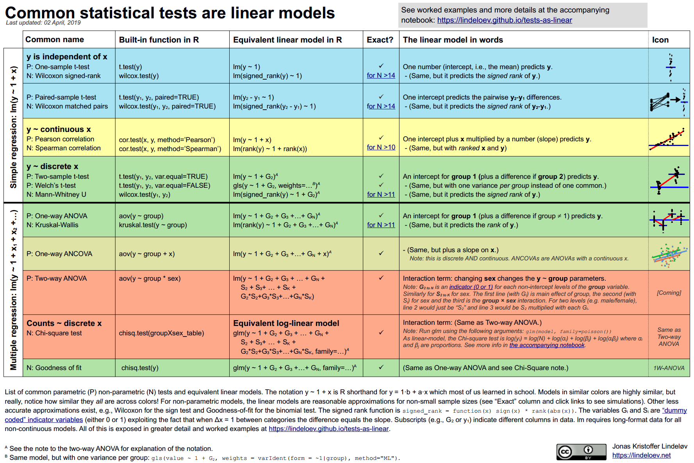
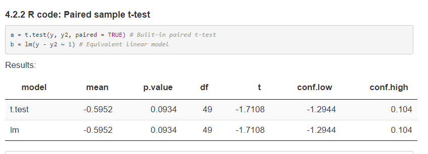

## R packages

```{r}
#| echo: true
#| message: false
knitr::opts_chunk$set(comment = NA)

library(here); library(janitor)
library(broom); library(car)
library(gt); library(GGally)
library(mosaic)       ## for df_stats() function
library(conflicted)   ## introduced today
library(MASS)         ## fitting robust linear models
library(quantreg)     ## fitting quantile regressions
library(easystats)
library(tidyverse)

theme_set(theme_bw()) 

conflicts_prefer(dplyr::select, base::max, base::mean)
```

## Today's Agenda

1. The `conflicted` package
2. It's Just a Linear Model
3. Fitting Robust Linear Models
    - with Huber weights
    - with the biweight
    - Quantile regression

## The conflicted package

<https://conflicted.r-lib.org/>

- The goal of conflicted is to provide an alternative conflict resolution strategy. R’s default conflict resolution system gives precedence to the most recently loaded package. This can make it hard to detect conflicts, particularly when introduced by an update to an existing package. conflicted takes a different approach, making every conflict an error and forcing you to choose which function to use.

## Conflict Resolution here

In the package setup today, I used the following code to resolve errors that came up in these slides:

**`conflicts_prefer(dplyr::select, base::max, base::mean)`**


- That was the complete set of conflicts I had to resolve to get the slides to run.
- As it turns out, though, there are lots of other conflicts that didn't crop up in building these slides, because the relevant conflict never emerged...

## What else does conflicted do?

The complete list of 35 conflicts is posted to [our README](https://github.com/THOMASELOVE/431-classes-2025/blob/main/class24/README.md).

```{r}
#| echo: true
#| warning: true

conflict_scout()
```

# It's Just a Linear Model

## Common Statistical Tests are Linear Models

Jonas Kristoffer Lindelov has built up a terrific resources to explain this at

<https://lindeloev.github.io/tests-as-linear/>

What's the point?

---



## Consider Study 1 from Project B.

- Analysis A. Compare two means/medians using paired samples
  - This is a linear model. See Section 4.2 of [Lindelov](https://lindeloev.github.io/tests-as-linear/)
  


## Project B Study 1?

- Analysis B. Compare two means/medians using independent samples
  - This is a linear model, and not just for the t test. See Section 5 of [Lindelov](https://lindeloev.github.io/tests-as-linear/)
- Analysis C. Compare 3-6 means/medians using independent samples
  - ANOVA is obviously a linear model, but actually we can generate (essentially) the Kruskal-Wallis this way, too. See Section 6.1 of [Lindelov](https://lindeloev.github.io/tests-as-linear/)
  
## Project B Study 1?

- Analysis D. Create and analyze a 2x2 table
  - Yes, the chi-square test of independence can emerge from a linear model. See Section 7.2 of [Lindelov](https://lindeloev.github.io/tests-as-linear/)
- Analysis E. Create and analyze a JxK table, where $2 \leq J \leq 5$ and $3 \leq K \leq 5$
  - Linear model, as in the 2x2 case. See Section 7.2 of [Lindelov](https://lindeloev.github.io/tests-as-linear/)

Analyses D-E are more commonly thought about in the context of generalized linear models, as we'll see in 432.

# Robust Linear Models: A Brief Introduction

## The `crimestat` data

For each of 51 states (including the District of Columbia), we have the state's ID number, postal abbreviation and full name, as well as:

- **crime** - the violent crime rate per 100,000 people
- **poverty** - the official poverty rate (% of people living in poverty in the state/district) in 2014
- **single** - the percentage of households in the state/district led by a female householder with no spouse present and with her own children under 18 years living in the household in 2016

## The `crimestat` data set

```{r}
#| echo: true
crimestat <- 
  read_csv(here("c24/data/crimestat.csv"), show_col_types = FALSE) |>
  janitor::clean_names()
crimestat
```

## Our objective

Our main goal will be to build a linear regression model to predict **crime** using centered versions of both **poverty** and **single**.

```{r}
#| echo: true
crimestat <- crimestat |>
    mutate(pov_c = poverty - mean(poverty),
           single_c = single - mean(single))
```

We're centering so that the intercept term is more interpretable.

## Numerical Summaries

```{r}
#| echo: true

df_stats(~ crime + poverty + pov_c + single + single_c, data = crimestat) |>
  gt() |> fmt_number(columns = min:sd, decimals = 2) |>
  tab_options(table.font.size = 24)
```


## Transform Outcome?

```{r}
#| echo: true
boxCox(lm(crime ~ pov_c + single_c, data = crimestat))
```

## Scatterplot Matrix

```{r}
#| echo: true
#| output-location: slide

temp <- crimestat |>
  mutate(logcrime = log(crime)) |>
  select(pov_c, single_c, logcrime)

ggpairs(temp,
        title = "Scatterplot Matrix for crimestat",
        lower = list(combo = wrap("facethist"), bins = 7))
```

## OLS linear model

```{r}
#| echo: true

crimestat <- crimestat |> mutate(logcrime = log(crime))
fit_ols <- lm(logcrime ~ pov_c + single_c, data = crimestat)
```

Note what happens when we put the model in parentheses...

```{r}
#| echo: true

(fit_ols <- lm(logcrime ~ pov_c + single_c, data = crimestat))
```

## Coefficients of `fit_ols`

```{r}
#| echo: true

model_parameters(fit_ols, ci = 0.95, 
                 pretty_names = FALSE, include_info = TRUE)
```

What do the 95% confidence interval estimates suggest about `pov_c` and `single_c`?

## Exponentiated Coefficients

```{r}
#| echo: true

model_parameters(fit_ols, exponentiate = TRUE, ci = 0.95, 
                 pretty_names = FALSE, include_info = TRUE)
```

## Performance of `fit_ols`

```{r}
#| echo: true

model_performance(fit_ols)
```


## OLS Checking (1/3)

```{r}
#| echo: true
check_model(fit_ols, check = c("linearity", "homogeneity"))
```

## OLS Checking (2/3)

```{r}
#| echo: true
check_model(fit_ols, check = c("pp_check", "outliers"))
```

## OLS Checking (3/3)

```{r}
#| echo: true
check_model(fit_ols, detrend = FALSE, check = c("normality", "qq"))
```

## Which points are of special interest?

Largest residuals in absolute value?

```{r}
#| echo: true
aug_ols <- augment(fit_ols)
aug_ols <- aug_ols |> mutate(state = crimestat$state, sid = crimestat$sid, 
                       abs_res = abs(.resid))
aug_ols |> select(sid, state, logcrime, pov_c, single_c, .resid, abs_res, 
               everything()) |>
  arrange(desc(abs_res)) |> head()
```

## Collinearity in `fit_ols`?

```{r}
#| echo: true
check_collinearity(fit_ols)
```

## Prediction for new data

- Declare outcome transformation in model.

```{r}
#| echo: true
fit_ols2 <- lm(log(crime) ~ pov_c + single_c, data = crimestat)
```

- "New" states: `pov_c` = 1, `single_c` = 2. 
- What does `fit_ols` predict for log(`crime`)?

```{r}
#| echo: true

estimate_expectation(fit_ols2, ci = 0.95, 
                     data = tibble(pov_c = 1, single_c = 2))
```


## Prediction for new data

Again, we assume we have multiple new states with `pov_c` = 1 and `single_c` = 2.

- What does `fit_ols` predict for average **crime**?

```{r}
#| echo: true
estimate_expectation(fit_ols2, ci = 0.95, transform = TRUE,
                     data = tibble(pov_c = 1, single_c = 2))
```

# Robust Linear Model with Huber weights

## Robust Linear Models

There are several ways to do robust linear regression using M-estimation, including weighting using Huber and bisquare strategies.

- Robust linear regression here will make use of a method called iteratively re-weighted least squares (IRLS) to estimate models. 
- M-estimation defines a weight function which is applied during estimation. 

## Using Huber weights

- The weights depend on the residuals and the residuals depend on the weights, so an iterative process is required.

We'll fit the model, using the default weighting choice: what are called Huber weights, where observations with small residuals get a weight of 1, and the larger the residual, the smaller the weight. 

## New model (using `MASS::rlm`)

```{r}
#| echo: true
rob_huber <- rlm(logcrime ~ pov_c + single_c, data = crimestat)

model_parameters(rob_huber, ci = 0.95, pretty_names = F, include_info = T)
```

Is this a very different result than ordinary least squares gave us?

## Glance: `rob_huber` and OLS

```{r}
#| echo: true
glance(rob_huber) |> gt() |> fmt_number(decimals = 2) |>
  tab_options(table.font.size = 24)

glance(fit_ols) |> 
  select(sigma, logLik, AIC, BIC, deviance, nobs, 
         r.squared, adj.r.squared) |>
  gt() |> fmt_number(decimals = 2) |>
  tab_options(table.font.size = 24)
```

## Understanding the Huber weights

Let's augment the data with results from this model, including the weights.

```{r}
#| echo: true
crime_with_huber <- augment(rob_huber, crimestat) |>
    mutate(w = rob_huber$w) |> arrange(w) 

crime_with_huber |> 
  select(sid, state, w, logcrime, crime, pov_c, single_c, 
         .fitted, .resid, everything()) |>
  head(4)
```

## Huber Weights

```{r}
#| echo: true
crime_with_huber |> select(state, w, .resid) |> 
  arrange(desc(abs(.resid))) |> head(4)
crime_with_huber |> select(state, w, .resid) |> 
  arrange(desc(abs(.resid))) |> slice(14,15,50,51)
```

## What is the pattern?

```{r}
#| echo: true
ggplot(crime_with_huber, aes(x = abs(.resid), y = w)) +
    geom_label(aes(label = state)) 
```

## Conclusions: Weights Plot

- District of Columbia will be down-weighted the most, followed by Vermont, then Alaska and and Mississippi. 
- But many of the observations will have a weight of 1. 
- In ordinary least squares, all observations would have weight 1.
- So the more cases in the robust regression that have a weight close to one, the closer the results of the OLS and robust procedures will be.

# Robust linear model using the biweight

## Using the biweight

The **biweight**, or bisquare or Tukey's bisquare is another weighing approach, in which all cases with a non-zero residual get down-weighted at least a little.

```{r}
#| echo: true

(rob_bw <- rlm(logcrime ~ pov_c + single_c,
                    data = crimestat, psi = psi.bisquare))
```

## Robust Model Coefficients

**Huber weights**

```{r}
#| echo: true
model_parameters(rob_huber, ci = 0.95, pretty_names = F)
```

**Bisquare weights**

```{r}
#| echo: true
model_parameters(rob_bw, ci = 0.95, pretty_names = F)
```

## Robust model performance

**Huber weights**

```{r}
#| echo: true
model_performance(rob_huber); n_obs(rob_huber)
```

**Bisquare weights**

```{r}
#| echo: true

model_performance(rob_bw); n_obs(rob_bw)
```

## `augment()` for `rob_bw`

```{r}
#| echo: true

crime_bw <- augment(rob_bw, newdata = crimestat) |> 
  mutate(w = rob_bw$w) |> 
  relocate(c(w, .resid), .before = crime) |> 
  arrange(w) 

head(crime_bw, 3) |> gt() # smallest three weights
tail(crime_bw, 3) |> gt() # largest three weights
```

## `rob_bw`: Weights vs. Residuals

```{r}
#| echo: true

ggplot(crime_bw, aes(x = abs(.resid), y = w)) +
    geom_label(aes(label = state)) 
```

## Conclusions from the biweights plot

Again, cases with large residuals (in absolute value) are down-weighted generally, but here, Vermont and Washington DC receive **no** weight in fitting the final model.

- We can see that the weight given to DC and Vermont is dramatically lower (in fact it is zero) using the bisquare and the parameter estimates from these two different weighting methods differ. 
- The maximum weight (here, for Hawaii) for any state using the biweight is still slightly smaller than 1.

# Quantile Regression

## Quantile Regression on the Median

We can use the `rq` function in the `quantreg` package to model the **median** of our outcome (violent crime rate) on the basis of our predictors, rather than the mean, as is the case in ordinary least squares.

```{r}
#| echo: true

(fit_q50 <- rq(logcrime ~ pov_c + single_c, data = crimestat))
```

## Coefficients in `fit_q50`

```{r}
#| echo: true

model_parameters(fit_q50, ci = 0.95, pretty_names = FALSE)

glance(fit_q50) |> gt() |> tab_options(table.font.size = 24)
```

## Estimating a different quantile

Estimate any quantile by specifying the `tau` ($\tau$) parameter.

- Default is `tau` = 0.5, which estimates the median.
- What about estimating, say, the 70th percentile?

```{r}
#| echo: true

(fit_quan70 <- rq(logcrime ~ pov_c + single_c, tau = 0.70, 
                  data = crimestat))
```

# Comparing our 4 models

## Comparing coefficients {.smaller}

```{r}
#| echo: true
compare_models(fit_ols, rob_huber, rob_bw, fit_q50, 
               ci = 0.95)
```

Can we plot these results?

## Comparing coefficients

```{r}
#| echo: true
plot(compare_models(fit_ols, rob_huber, rob_bw, fit_q50, 
               ci = 0.95))
```

## Exponentiated coefficients

```{r}
#| echo: true
#| warning: false
plot(compare_models(fit_ols, rob_huber, rob_bw, fit_q50, 
               ci = 0.95, exponentiate = TRUE)) +
  xlim(0.90, 1.25) + geom_vline(xintercept = 1, lty = "dashed")
```

## Comparing performance

```{r}
#| echo: true
compare_performance(fit_ols, rob_huber, rob_bw, fit_q50)
```

## Comparing performance

```{r}
#| echo: true
plot(compare_performance(fit_ols, rob_huber, rob_bw, fit_q50))
```

## Prediction in new data

1. Declare outcome transformation in each model.

```{r}
#| echo: true

rob_huber2 <- rlm(log(crime) ~ pov_c + single_c, data = crimestat)
rob_bw2 <- rlm(log(crime) ~ pov_c + single_c, 
               data = crimestat, psi = psi.bisquare)
fit_q50 <- rq(log(crime) ~ pov_c + single_c, data = crimestat)
```

2. "New" states: all have `pov_c` = 1 and `single_c` = 2. 

```{r}
#| echo: true
new_dat <- tibble(pov_c = 1, single_c = 2)
```

## Predictions: Huber weights

```{r}
#| echo: true
estimate_expectation(rob_huber2, ci = 0.95, data = new_dat)
estimate_expectation(rob_huber2, ci = 0.95, transform = TRUE, data = new_dat)
```

## Predictions: Bisquare weights

```{r}
#| echo: true
estimate_expectation(rob_bw2, ci = 0.95, data = new_dat)
estimate_expectation(rob_bw2, ci = 0.95, transform = TRUE, data = new_dat)
```

## Quantile (median) regression

```{r}
#| echo: true
estimate_expectation(fit_q50, ci = 0.95, data = new_dat)
estimate_expectation(fit_q50, ci = 0.95, transform = TRUE, data = new_dat)
```

## Wrapping Up

1. When comparing the results of a regular OLS regression and a robust regression for a data set which displays outliers, if the results are very different, you will most likely want to use the results from the robust regression. 
    - Large differences suggest that the model parameters are being highly influenced by outliers. 

## Wrapping Up

2. Different weighting functions have advantages and drawbacks. 
    - Huber weights can have difficulties with really severe outliers.
    - Bisquare weights can have difficulties converging or may yield multiple solutions. 
    - Quantile regression approaches have some nice properties, but describe medians (or other quantiles) rather than means.

## Session Information {.smaller}

```{r}
#| echo: true

xfun::session_info()
```


